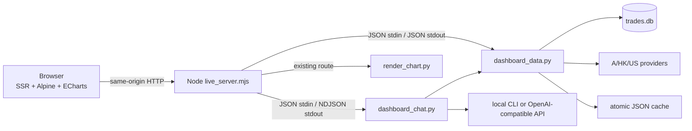

# Technical Design — STJ 跨市场投资数据看板与全局问 AI

## 1. Design Summary

本任务在现有 `stock-trade-journal` 内扩展，不创建第二套应用：

- Node `live_server.mjs` 仍是唯一 HTTP 入口，负责静态资源、SSR 壳、JSON API、Python 子进程和流式响应。
- 浏览器使用 vendored Alpine.js 管理页面状态，ECharts 继续负责图表；无 npm 构建、无 CDN。
- Python dashboard service 统一读取 SQLite、调用 A/港/美 provider、规范化字段、缓存和组装 AI 上下文。
- 原 `render_chart.py` + `stock-chart.html` 作为 K 线子页面继续工作，详情页嵌入而不重写核心交互。
- AI 配置保留在浏览器；API/CLI 请求由独立 Python runtime 执行，API Key 只经 stdin 进入子进程。



## 2. Constraints and Invariants

1. `db_schema.py` 是 SQLite schema 与 accessor 的唯一所有者；Node 和 provider 不直接写 SQL。
2. `parse_ts_code`、组合人民币权重、同公司暴露只复用现有实现，不创建平行算法。
3. 旧 `/api/data`、`/chart`、`/charts/*` 保持兼容，K 线交互逐项回归。
4. 外部数据永远不是本地持仓/交易事实源；失败时不反写持仓表。
5. 缺失值是 `null`，过期值是显式 `stale`，代理指标是显式 `metric_kind`。
6. API Key、后端访问密钥和 CLI 登录态不得进入参数列表、日志、SQLite、缓存或 fixture。
7. 交付产物 self-contained；Vibe 与外部 skill 路径仅在开发期用于对照。

## 3. Planned File Layout

```text
stock-trade-journal/
├── assets/
│   ├── alpine.min.js              # vendored + license notice
│   ├── dashboard.css
│   ├── dashboard.js
│   └── echarts.min.js             # existing
├── templates/
│   ├── dashboard.html
│   └── stock-chart.html           # existing contract
├── scripts/
│   ├── live_server.mjs            # entry/config/route registration
│   ├── live/
│   │   ├── api_routes.mjs
│   │   ├── http_helpers.mjs
│   │   └── python_bridge.mjs
│   ├── dashboard_data.py          # argparse subcommands, JSON stdout
│   ├── dashboard_chat.py          # one request on stdin, NDJSON stdout
│   └── dashboard/
│       ├── __init__.py
│       ├── cache.py
│       ├── context.py
│       ├── contracts.py
│       ├── service.py
│       ├── ai/
│       │   ├── catalog.py
│       │   ├── cli_runtime.py
│       │   ├── openai_runtime.py
│       │   └── tools.py
│       └── providers/
│           ├── base.py
│           ├── a_stock.py
│           └── global_stock.py
└── tests/
    ├── fixtures/
    ├── test_dashboard_*.py
    └── live_server.test.mjs
```

若实施中发现一个计划模块不足 80 行且没有独立职责，可以合并；不得反向把 provider、AI 与路由全部堆回 `live_server.mjs`。

## 4. Runtime Flow

### 4.1 Page and data flow

1. Node 返回 `dashboard.html`，只注入非敏感启动配置和当前 route。
2. Alpine 先请求本地事实数据，立即渲染持仓/关注；外部模块按 tab 或详情懒加载。
3. Node 通过参数数组 `spawn()` Python，不使用 shell；查询参数先在 Node 做长度/字符/枚举校验。
4. `dashboard_data.py` 调 service；service 读取本地 accessor、命中缓存或调用 provider，再统一响应。
5. 页面收到部分成功时渲染成功 section，并在失败 section 提供重试。

### 4.2 Ask AI flow

1. 浏览器从 `localStorage` 读取当前 AI 配置，连同问题、短会话历史和页面 context descriptor 发到 `/api/chat`。
2. Node 校验 body 大小、配置类型和可选 `STJ_API_KEY`，将请求 JSON 写入 `dashboard_chat.py` stdin；密钥不进入 argv。
3. Chat runtime 用 dashboard context builder 获取可信上下文：
   - CLI 模式：在预算内预装本地事实、页面数据和来源摘要，CLI 无工具权限。
   - API 模式：预装最小页面上下文，同时向模型声明受控只读工具；工具调用回到 dashboard service。
4. Python 输出 NDJSON，Node 原样流式转发；客户端可用 AbortController 停止，Node 随即终止子进程。
5. “存入研究记录”是后续显式 POST，不在聊天完成时自动写库。

## 5. HTTP Contract

### 5.1 Standard envelope

除 `/api/chat` 外，所有新接口返回：

```json
{
  "ok": true,
  "data": {},
  "meta": {
    "request_id": "uuid",
    "generated_at": "2026-07-10T12:00:00+08:00",
    "as_of": "2026-07-10T11:59:30+08:00",
    "market": "US",
    "sources": [{"name": "yahoo", "as_of": "..."}],
    "cache": {"hit": true, "stale": false, "age_seconds": 20},
    "warnings": []
  },
  "errors": []
}
```

错误项结构：

```json
{
  "scope": "financials.cash_flow",
  "provider": "sec",
  "code": "UPSTREAM_TIMEOUT",
  "message": "现金流数据暂不可用",
  "retryable": true
}
```

- 参数/权限错误：4xx。
- 所有必需 provider 均失败且无缓存：502/504。
- 部分模块失败：HTTP 200，`ok=true`，同时返回非空 `errors` 和 warning。
- 意外异常：500；浏览器只接收稳定错误码，不接收 traceback。

### 5.2 Routes

| Method | Path | Purpose |
| --- | --- | --- |
| GET | `/api/portfolio` | 组合汇总、持仓、报价、权重、提醒 |
| GET | `/api/watchlist` | 关注列表、目标/止损、报价与状态 |
| GET | `/api/stock/context?code=` | 本地事实、报价、公司业务与估值摘要 |
| GET | `/api/stock/financials?code=&period=` | 财务序列与质量指标 |
| GET | `/api/stock/flow?code=` | 适用的资金、两融、龙虎榜等 |
| GET | `/api/stock/intel?code=&kind=` | 新闻、研报、公告 |
| GET | `/api/stock/options?code=` | 适用标的期权；不可用返回 capability |
| GET | `/api/daily-review?market=` | 指数、全球市场、温度与轮动 |
| GET | `/api/intel?scope=&market=&kind=` | 资讯雷达聚合 |
| GET/POST | `/api/sectors` | 列表 / 新建板块 |
| GET/PATCH/DELETE | `/api/sectors/:id` | 读取 / 修改 / 归档板块 |
| POST/PATCH/DELETE | `/api/sectors/:id/{tags,nodes,edges,symbols,knowledge}` | 子资源 CRUD |
| GET | `/api/ai/capabilities` | CLI 可用性、支持模式与模型目录（无密钥） |
| POST | `/api/chat` | NDJSON 流式聊天 |
| POST | `/api/research-records` | 用户确认后保存 AI 研究记录 |

`DELETE /api/sectors/:id` 是软归档；子资源 DELETE 是精确删除。写接口要求 JSON、同源请求和可选后端鉴权。

### 5.3 Chat NDJSON events

每行一个 JSON object，事件顺序可为：

- `meta`：request id、模型标签、上下文摘要。
- `delta`：增量文本。
- `tool_start`：工具名和脱敏参数。
- `tool_result`：来源、耗时、条数、截断状态和可展示错误，不发送超限原始结果。
- `done`：usage（若 provider 提供）、引用列表、可保存 payload id。
- `error`：稳定错误码、可重试性。

流在 `done` 或 `error` 结束。客户端收到未知事件时忽略并记录开发警告，不崩溃。

## 6. Domain Contracts

### 6.1 Asset and quote

```text
AssetRef: ts_code, symbol, name, market_group(A|HK|US), exchange, currency
Quote: last, previous_close, change, change_pct, quote_time, source, delayed, stale
```

`ts_code` 是内部主键；展示代码与 provider code 由 adapter 映射。价格保留原币种。组合层额外返回 `fx_to_cny`、`fx_as_of`、`market_value_cny_est` 和 `weight`。

### 6.2 Portfolio row

```text
asset, quantity, avg_cost, quote,
market_value_original, market_value_cny_est,
unrealized_pnl_original, return_rate, weight,
same_company_group?, alerts[], data_status
```

收益金额和收益率来自同一报价快照。无法取得报价时保留本地数量/成本，其他派生值为 null 并说明原因。

### 6.3 Financial series

```text
period_end, period_type(FY|Q|TTM), fiscal_year, currency,
revenue, net_income, free_cash_flow,
gross_margin, operating_cash_ratio, r_and_d,
eps_actual, eps_consensus, debt_ratio,
working_capital, receivables, inventory,
source, filed_at
```

不同币种、周期或会计口径分别成 series。自由现金流若为计算值，返回公式和组成字段，不伪装成原始披露。

### 6.4 Intel item

```text
id, kind(news|report|filing|investment_news), title, summary?,
related_assets[], source_name, source_url,
published_at, fetched_at, risk_tags[], relevance_score, dedupe_key
```

`dedupe_key` 使用规范化 URL；无 URL 时使用标题+来源+日期 hash。AI 摘要与原始标题分字段。

### 6.5 Rotation item

```text
market, sector_name, metric_kind(net_flow|performance_proxy),
metric_value, metric_unit, rank, period, as_of, source
```

UI 根据 `metric_kind` 选择标题和单位，禁止仅凭 market 猜口径。

## 7. Provider Layer

每个 provider 函数遵循相同内部结果：`data + source metadata + warnings`，只抛分类异常（validation/auth/rate_limit/timeout/schema/upstream）。service 决定 fallback，页面不感知上游字段名。

### 7.1 Source policy

- 详细矩阵见 `research/data-source-matrix.md`。
- provider 按“已验证首选 → 已验证备选 → 合法 stale cache”执行；未验证备选不进入自动 fallback。
- 请求都设置 connect/read timeout、最大响应体与 User-Agent；解析前校验 content-type/基本 schema。
- 所有外部链接只作为展示来源，后端不根据模型传入的 URL 发请求。

### 7.2 Eastmoney and concurrency

Node 会产生多个 Python 进程，因此单进程 `sleep` 不足以保护东财：

- 在 cache 目录维护不含业务数据的 rate-gate 文件，以 `fcntl.flock` 做跨进程互斥。
- 所有东财请求必须经过一个 shared client；最小间隔 1 秒 + 0.1–0.5 秒抖动。
- 429/5xx 指数退避且有上限；403 立即失败并尝试已验证非东财备选。
- 同一页面聚合请求优先一次批量调用，避免 Alpine 同时触发多个同源端点。

### 7.3 Yahoo session

Yahoo cookie/crumb 由单一 manager 维护；如需跨进程缓存，仅保存短期 cookie state 到 0600 文件并设 TTL。失败时重新握手一次，不做无限刷新。

## 8. Cache Design

- 路径：`~/.trade-journal/results/trade-journal/cache/dashboard/`。
- key：`sha256(contract_version + provider + operation + normalized params)`；任何密钥、token、完整请求头不得进入 key 或 value。
- 写入：同目录临时文件、flush/fsync 后原子 rename，文件权限 0600。
- 默认 TTL：quote 30–60 秒；指数 60 秒；市场/轮动开盘 5 分钟、收盘 30 分钟；flow/options 5 分钟；valuation/news 15 分钟；reports 6 小时；financials 12–24 小时；profile 7 天；SEC 24 小时。
- stale-if-error：只有存在成功解析且 contract version 相同的缓存时可回退；必须标出 age、stale 和失败原因。
- cache corruption：隔离坏文件并重新获取，不把 JSON decode error 返回成空数据。

## 9. SQLite Schema Extension

`db_schema.py` 以 `CREATE TABLE IF NOT EXISTS` + 前向迁移新增下列表；既有表列、约束和 accessor 语义保持不变。

| Table | Key fields and constraints |
| --- | --- |
| `sectors` | id, slug UNIQUE, name, summary, status(active/archived), created_at, updated_at |
| `sector_tags` | id, sector_id, name, UNIQUE(sector_id,name) |
| `sector_nodes` | id, sector_id, name, stage(upstream/midstream/downstream), description, bottleneck, sort_order |
| `sector_edges` | id, sector_id, from_node_id, to_node_id, relation, sort_order, UNIQUE(sector_id,from_node_id,to_node_id,relation) |
| `sector_symbols` | sector_id, ts_code, role, note, PRIMARY KEY(sector_id,ts_code) |
| `sector_knowledge` | id, sector_id, kind, title, content, source_url, as_of, created_at, updated_at |
| `research_records` | id, scope_type, ts_code?, sector_id?, question, answer, sources_json, context_summary_json, model_label, created_at |

规则：

- 枚举集中在 `db_schema.py` 常量中，由 accessor 验证；路由不复制枚举。
- 所有写操作参数化、事务化；产业链删除节点时由 accessor 同一事务删除相关 edge。
- 板块 DELETE 仅改 `status=archived`；显式恢复可重新激活。
- `research_records` 只存用户确认保存的内容；保存前删除配置、请求头、工具内部参数中的敏感字段。
- 迁移测试对空库和匿名化现有库副本执行；升级前后既有四类核心记录数与查询结果一致。

## 10. AI Design

### 10.1 Browser config

版本化 key 为 `stj.ai.config.v1`：

```text
mode: cli | api
provider_id, model, base_url, api_key
backend_access_key?
default_context: portfolio/watchlist/notes/news/reports/sector flags
answer_style: conclusion/evidence/counter_evidence/discipline flags
```

只有当前配置持久化。能力目录和预设不含 secret；“清除配置”删除完整 key 和会话历史。页面禁止把 config 注入 HTML 或 URL。

### 10.2 CLI runtime

- 以 `research/ai-configuration-matrix.md` 的 binary/delivery/argument/stream parser 映射为基线，逐个 capability probe；未安装、未登录和超时分开提示。
- `shell=false`，固定 executable/argument template；用户不能输入 binary 或任意参数。
- Claude 使用 system 临时文件 + user stdin，Qwen/Codex 使用 stdin；DeepSeek 若当前版本仍只支持位置参数，保持 110KB 上限并向用户提示本机进程参数可见性，同时优先探测安全 stdin 方式。
- 所有 CLI 在空临时目录运行并禁用工具/限制权限。Vibe 的 Qwen `--yolo`、DeepSeek `--auto` 不能不经验证原样启用；找不到安全 no-tool 方式时 capability 必须显示风险或不可用。
- 进程环境只继承登录所需的最小集合；停止请求先 terminate，超时再 kill。
- CLI 不启用 tool calling。context builder 预装页面事实，并对长新闻/记录按时间、权重与相关性裁剪。

### 10.3 API runtime and tools

- OpenAI-compatible endpoint 走 streaming chat completions；预设只提供默认 Base URL/Model，用户可覆盖。
- function calling 最多 6 轮；单工具最多 20 条，注入模型默认最多 6,000 字符，内部未裁剪 payload 硬上限 50KB，整个 context 有明确 token/字符预算。
- 工具清单见 `research/implementation-boundaries.md`，均为只读 service 函数；参数使用 JSON Schema enum/长度/代码校验。
- 工具轨迹返回来源和摘要，不把整份未裁剪 provider payload 暴露给页面或继续塞回模型。
- 不支持 function calling 的兼容端点自动降级为“预装 context + 无工具”，UI 明确显示能力降级。

### 10.4 SSRF and secret handling

- Base URL 只允许 `http/https`，拒绝 URL credentials、metadata IP、无效端口和非 HTTP scheme。
- 默认 loopback 服务允许用户显式配置 localhost/Ollama；若服务监听非 loopback，则拒绝所有 private/link-local/loopback 目标。
- DNS 解析后再检查 IP；每次 redirect 重新校验，限制 redirect 次数。
- API Key 从浏览器请求体进入 Node，再经 stdin 进入 Python；日志只记录 provider id/model/host 和 request id。
- 可选 `STJ_API_KEY` 通过 Authorization header 校验；默认 loopback 可不设置，非 loopback 启动必须设置。

## 11. Frontend Design

### 11.1 State boundaries

- 一个 `dashboardApp` 管导航、全局错误、当前详情和 AI 抽屉。
- 各页面拥有独立 store 与 AbortController；切 tab 取消不再需要的请求。
- URL 保存当前一级页面和选中 `ts_code`，刷新/前进后退可恢复；敏感配置不进 URL。
- 所有外部文本默认用 `textContent` / Alpine `x-text`；需要富文本时使用严格 allowlist sanitizer。

### 11.2 K-line compatibility

详情页通过同源 iframe/嵌入现有 `/chart`，只在外层增加 tab 和高度通信。原模板继续拥有：

- 曲线/K线切换、crosshair、dataZoom、period；
- B/S/T 圆形交易点、“记”菱形笔记点与 tooltip；
- 现价实线、均价蓝虚线、目标红虚线、止损绿虚线；
- 持仓/均价/市值/浮盈/收益/交易数/关注状态/记录数胶囊；
- 图下“交易标注/关注记录”两栏。

任何重构都先用截图和 DOM/数据 fixture 对照；正式详情不得复制一份不同的交易/笔记列表。

### 11.3 P&L color

统一 CSS token：`--profit` 红、`--loss` 绿、`--neutral` 中性、`--missing` 弱化。金额和比例位于同一组件，共用符号和颜色逻辑；不能只靠颜色，必须保留 `+/-` 文本。

## 12. Reliability and Security

- Node 限制 JSON body、query 长度、并发 Python 数；每类 child process 有 timeout。
- 静态文件只从明确 assets/templates root 解析并检查 realpath，防止 path traversal。
- 默认无宽泛 CORS；写请求校验 Content-Type 和 Origin。
- 新闻/笔记/AI 输出在 DOM 注入前转义；外链使用 `rel="noopener noreferrer"`。
- provider 响应大小有上限；HTML/JSON schema 不符时分类为上游 schema error。
- Node 退出时清理 child；客户端断开时停止对应进程；stderr 脱敏后只进本地开发日志。
- 所有写库接口串行化到短事务，失败回滚；读取使用独立连接。

## 13. Test Strategy

### 13.1 Offline automated tests

- Python `unittest`：代码映射、数字/null、财务周期、rotation metric、缓存 TTL/stale/corruption、限流 gate、provider fixture、schema/accessor、上下文裁剪、AI tool 校验和 secret redaction。
- Node `node:test`：route/method/query/body/status mapping、spawn 参数、client abort、NDJSON passthrough、静态路径和 auth。
- Contract fixtures：A/港/美各至少一个正常、缺字段、schema 变化和 provider error 样本。
- Migration：空库 + 匿名化现有库副本；比较既有 trades/positions/watchlist/notes 数据。
- Frontend：纯函数与 DOM smoke；K 线截图/关键 marker 数据与现有版本对照。

### 13.2 Opt-in live smoke

通过显式环境变量运行少量外网 smoke，验证 A/港/美各一个报价、一个财务、一个资讯以及 AI 测试端点。它不属于默认 CI，失败必须区分网络、限流与 schema 漂移。

### 13.3 Manual acceptance

- 使用真实持仓/关注验证权重、同公司暴露、目标/止损和缺失报价。
- 用 A/港/美各一只票走完详情 tab。
- 用已安装 CLI 和一个 OpenAI-compatible API 各跑一轮多轮问答、停止、失败恢复和保存研究记录。
- 断网后验证 stale/partial/empty/error，不得出现伪数据。
- 桌面与窄屏检查导航、详情、表格和 AI 抽屉。

## 14. Rollout and Rollback

- 开发期间用 `STJ_DASHBOARD_V2` 切换新/旧首页；新版本验收完成后默认启用，旧 render 分支至少保留一个发布周期。
- 新 API 只增不改；旧 `/api/data` 保持原字段。
- SQLite 迁移只新增表/索引。回滚旧代码会忽略新表，不能要求删除表；实现前先备份 DB 并记录恢复命令。
- provider cache 可安全删除；contract version 变化自动换 key，不做原地破坏性迁移。
- 单一模块问题优先关闭 capability/route，不回滚交易台账；AI 问题可禁用 `/api/chat` 而不影响数据看板。

## 15. Traceability

| Requirement group | Design sections |
| --- | --- |
| NAV / PORT | 4, 5, 6, 11 |
| STOCK | 5, 6, 7, 11 |
| RADAR / REVIEW | 5, 6, 7, 8 |
| SECTOR | 5, 9 |
| AI | 4.2, 5.3, 10, 12 |
| DATA / NFR | 5–8, 12–14 |
