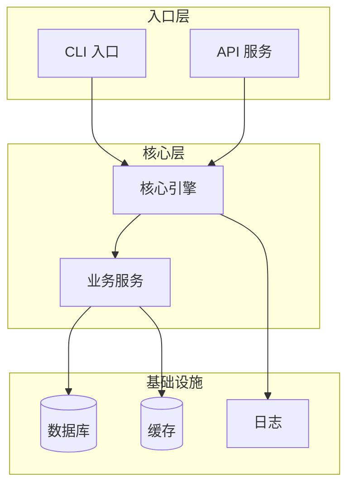
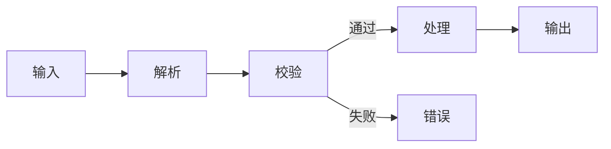
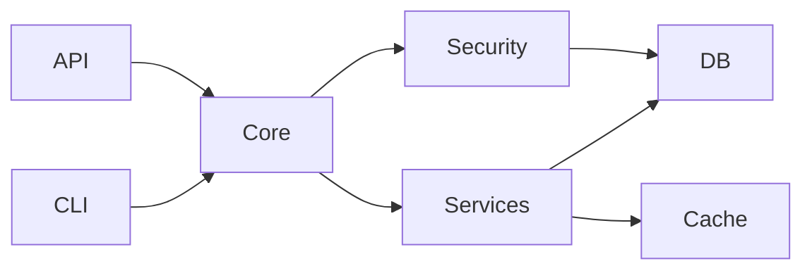
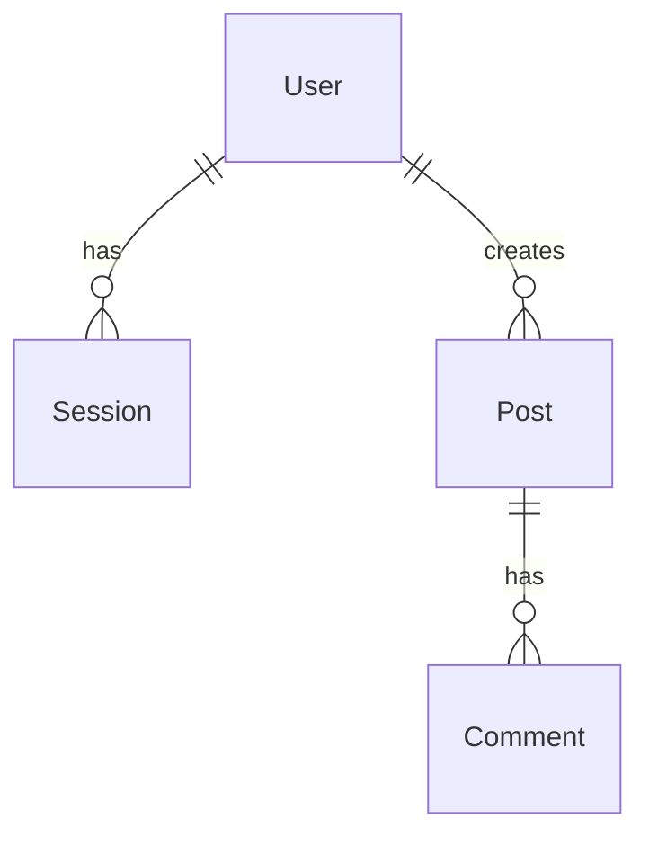
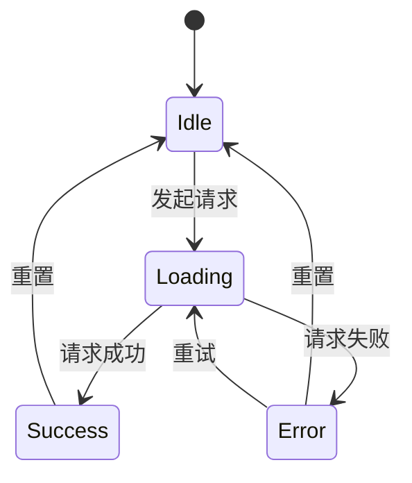

# 模块拆解模板 (`/project-analyzer modules`)

**目的：** 理解实现流程和原理

**触发词：** `modules`, `模块拆解`, `拆解模块`

---

## 输出模板

```markdown
# [项目名] 模块拆解

> 分析框架: project-analyzer v6
> 分析时间: [日期]

---

## 整体架构



---

## 目录结构

```
src/
├── cli/           # CLI 入口
│   └── index.ts   # 命令行解析
├── api/           # HTTP 接口
│   ├── router.ts  # 路由定义
│   └── handlers/  # 请求处理器
├── core/          # 核心逻辑
│   ├── engine.ts  # 主引擎
│   └── loop.ts    # 主循环
├── services/      # 业务服务
│   ├── user.ts    # 用户服务
│   └── auth.ts    # 认证服务
├── db/            # 数据库层
│   └── client.ts  # 数据库客户端
└── utils/         # 工具函数
    └── helpers.ts # 通用工具
```

---

## 模块 1：[模块名称] (`路径`)

### 职责

[一句话说明这个模块干什么]

### 实现原理

[2-3 段话解释核心设计思路]

- **为什么这样设计：** [原因]
- **关键技术点：** [技术点]
- **与其他模块的关系：** [关系]

### 执行流程



### 核心代码

```typescript
// 文件路径:行号
// 关键代码片段，带注释说明

export async function mainFunction(input: Input): Promise<Output> {
  // 步骤 1: 解析输入
  const parsed = parse(input);

  // 步骤 2: 校验
  if (!validate(parsed)) {
    throw new ValidationError();
  }

  // 步骤 3: 核心处理逻辑
  const result = await process(parsed);

  return result;
}
```

### 关键点

- **[关键点 1]:** [说明]
- **[关键点 2]:** [说明]
- **[关键点 3]:** [说明]

### 边界情况

| 情况 | 处理方式 | 代码位置 |
|------|----------|----------|
| [情况 1] | [处理] | `file:line` |
| [情况 2] | [处理] | `file:line` |

---

## 模块 2：[模块名称] (`路径`)

[同上格式]

---

## 模块 3：[模块名称] (`路径`)

[同上格式]

---

## 模块间依赖关系

### 依赖图



### 依赖矩阵

| 模块 | 依赖 | 被依赖 |
|------|------|--------|
| CLI | Core | - |
| API | Core | - |
| Core | Services, Security, Logger | CLI, API |
| Services | DB, Cache | Core |
| Security | DB | Core |
| DB | - | Services, Security |
| Cache | - | Services |

### 调用链路示例

**场景：用户登录**

```
1. CLI/API 接收请求
   ↓
2. Core.authenticate(credentials)
   ↓
3. Security.validateCredentials(credentials)
   ↓
4. DB.findUser(email)
   ↓
5. Security.comparePassword(input, hash)
   ↓
6. Core.generateToken(user)
   ↓
7. 返回 token
```

---

## 数据模型

### 核心实体

```typescript
// 用户实体
interface User {
  id: string;
  email: string;
  name: string;
  createdAt: Date;
}

// 会话实体
interface Session {
  id: string;
  userId: string;
  token: string;
  expiresAt: Date;
}
```

### 实体关系



---

## 状态管理

### 状态流转



### 状态存储位置

| 状态类型 | 存储位置 | 生命周期 |
|----------|----------|----------|
| 用户会话 | Redis | 24 小时 |
| 请求上下文 | 内存 | 单次请求 |
| 配置 | 环境变量 | 进程生命周期 |

---

## 错误处理

### 错误层次

```
BaseError
├── ValidationError
│   ├── InvalidInputError
│   └── MissingFieldError
├── AuthError
│   ├── UnauthorizedError
│   └── ForbiddenError
└── SystemError
    ├── DatabaseError
    └── NetworkError
```

### 错误处理策略

| 错误类型 | 处理方式 | 返回给用户 |
|----------|----------|------------|
| ValidationError | 立即返回 | 详细错误信息 |
| AuthError | 记录日志 | 通用错误信息 |
| SystemError | 报警 + 重试 | "服务暂时不可用" |
```

---

## 工作流程

### Phase 1: 识别模块边界

```bash
# 查看目录结构
ls -la src/

# 查看主要入口
rg "export (function|class|const)" --type ts src/ | head -50

# 识别模块间 import 关系
rg "^import .* from ['\"]\.\./" --type ts | head -30
```

### Phase 2: Hot Spot Detection

使用 Hot Spot 算法识别每个模块中最重要的文件：

```bash
# 引用计数
rg "from ['\"]\./" --type ts | cut -d: -f2 | sort | uniq -c | sort -rn | head -20

# Git 热度
git log --since="6 months ago" --name-only --pretty=format: | sort | uniq -c | sort -rn | head -20
```

**优先深入分析得分最高的文件。**

### Phase 3: 逐模块分析

对每个核心模块：

1. **读入口文件** — 理解模块职责
2. **追踪调用链** — 理解执行流程
3. **画流程图** — 可视化
4. **提取关键代码** — 展示核心逻辑
5. **记录边界情况** — 完整性

### Phase 4: 汇总依赖关系

```bash
# 生成 import 依赖图数据
rg "^import .* from" --type ts -o | \
  sed 's/import .* from //' | \
  tr -d "'" | tr -d '"' | \
  sort | uniq -c | sort -rn
```

---

## 质量检查清单

### 必须包含
- [ ] 整体架构 Mermaid 图
- [ ] 目录结构说明
- [ ] 至少 3 个核心模块的深入分析
- [ ] 每个模块包含：职责、原理、流程图、核心代码
- [ ] 模块间依赖关系图
- [ ] 至少 1 个调用链路示例

### 可选包含
- [ ] 数据模型 ER 图
- [ ] 状态流转图
- [ ] 错误处理层次

### 禁止
- [ ] 只列文件不解释
- [ ] 无代码示例
- [ ] 无 Mermaid 图
