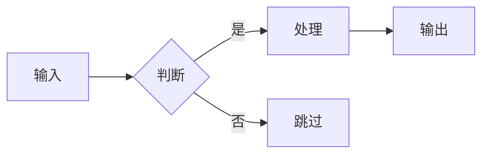
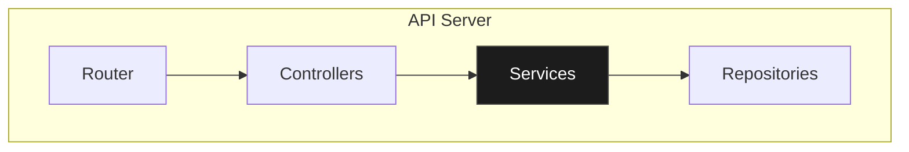
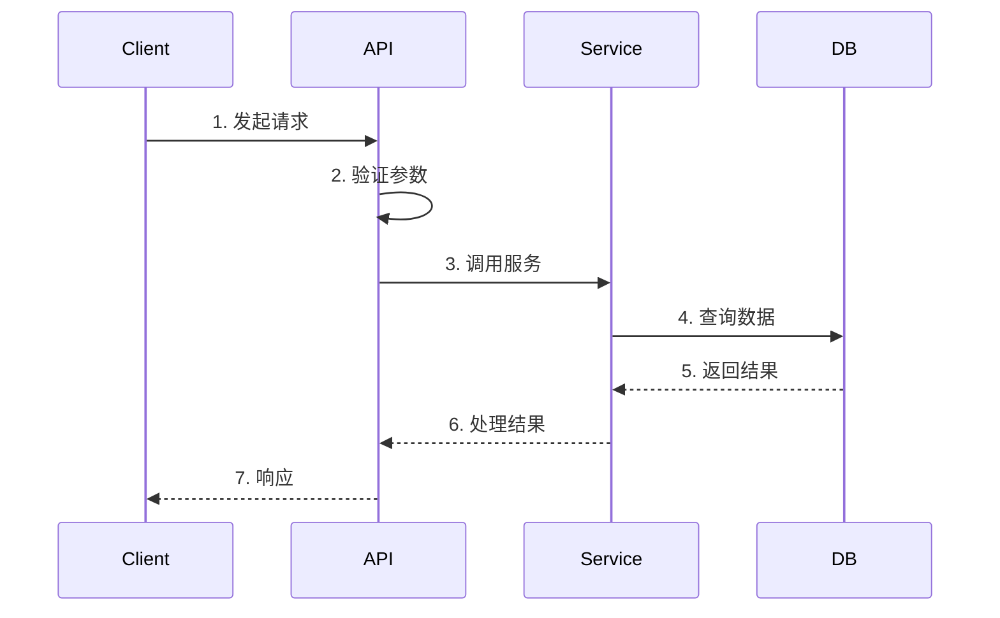

# Project Analyzer v7

深度拆解开源项目：能力清单 + 核心机制 + C4 架构图 + 代码规范检测 + 设计权衡 + 使用陷阱 + 定性结论。

> **核心理念**：不是"这个项目有哪些文件"，而是"这个项目能帮我做什么"+"它是怎么做到的"+"我能信任它吗"。

---

## 写作风格：像人写的，不是工具生成的

读者是工程师。目标是让报告读起来像一个有经验的人**亲手写的技术备忘**，而不是模板填出来的。这是贯穿全文的硬约束，下面所有模板都服从它——模板给的是**信息结构**，不是要逐字照抄的腔调。

**不要做的：**
- **不要伪量化**——不打 `82/100`、不列权重百分比、不做星级 `⭐⭐⭐⭐☆`。主观判断用文字说清，并附证据。
- **不要套话标签**——不写"一句话总结 / 一句话定位 / 一句话建议"这种开场标签。直接说，而且要说得漂亮。
- **不要套模板的比喻/举例**——比喻和例子是好东西，**要用**（见下方「要做的」）；但别套"举个例子：假设你 X""类比：就像 Y，把复杂变简单"这种填空标签，也别每个概念都硬塞一个。几个**真正贴切**的就够；空泛的比喻比没有更糟。
- **不要 emoji 当装饰**——✅⚠️🔴🏆🪗👤 一律不用。要标注取舍就用文字（"代价是…""风险在…"）。
- **不要工具签名**——不写"由 project-analyzer 自动生成""分析框架: vX"这种页眉页脚，不放假进度条。
- **不要无脑表格化**——两三行能讲完的用句子写。表格只留给真正"多行 × 多列"的结构化数据。

**要做的：**
- **证据先行**——每个判断后跟 `file:line` 或具体事实。说不出证据的判断就删掉。
- **句式有变化**——长短句交替，别每段都是"X 是 Y，因为 Z"。
- **把它讲活（加分项，别省）**——开头用一句生动、一针见血的话点出这东西的本质；该比喻就给一个贴切的，该举例就举一个真实具体的场景。生动靠的是**贴切的意象**（"把上下文画成一张可折叠的手风琴""把黑箱变成可操控的地图"），让人**瞬间抓住机制**——不是靠"一句话总结："这种标签。生动和精确不冲突。
- **敢下判断，也敢留白**——拿不准就写"未验证""只有一次跑分支撑"，不假装确定。
- **结论服务于决策**——读者要的是"我该不该用它、从哪开始读"，不是功能罗列。

> 自检：把标题和署名去掉，这段话像不像一个资深同事在 Slack 里给你讲这个项目——既有一针见血的妙喻，又句句有依据？不像，就重写。

---

## 能做什么

| 功能 | 说明 |
|------|------|
| **C4 架构图** | 自动生成 Level 1-3 的 ASCII 线框架构图（密集组件图回退 Mermaid flowchart） |
| **Convention 检测** | 命名规范、代码模式、Git 规范自动识别 |
| **ADR 增强** | 标准 MADR 格式的设计决策记录 |
| **进度显示** | 分析过程中显示 Phase 进度条 |
| **CLAUDE.md 生成** | 一键生成项目配置文件 |
| **并行分析** | 多个分析任务并行执行 |
| **HTML 输出** | 可输出自包含单文件 HTML；Mermaid 图**构建时渲染成内联 SVG**（零运行时依赖、离线可看），支持 md / html / 两者 |

---

## 五个触发命令

| 命令 | 输出 | 目的 |
|------|------|------|
| `/project-analyzer` | 分析报告 | 项目是什么、值不值得用 |
| `/project-analyzer modules` | 模块拆解 | 理解实现流程和原理 |
| `/project-analyzer setup` | 启动指南 | 把项目跑起来 |
| `/project-analyzer claude-md` | CLAUDE.md | 生成项目配置文件 |
| `/project-analyzer save` | 保存到文件 | 输出 MD 文件到项目目录 |

**路由逻辑：**
- 包含 `modules` 或 `模块拆解` → 输出模块拆解文档
- 包含 `setup` 或 `启动指南` 或 `怎么跑起来` → 输出启动指南
- 包含 `claude-md` 或 `生成 CLAUDE.md` → 输出 CLAUDE.md
- 包含 `save` 或 `--save` 或 `保存分析报告` 或 `输出到文件` → 保存报告到文件
- 否则 → 输出分析报告（默认）

**格式选择（与 save 组合）：**
- 默认（仅 `save`）→ 输出 **Markdown**
- 含 `--html` 或 `html` 或 `网页` → 输出 **HTML**（自包含单文件，见[文档 5](#文档-5html-输出-project-analyzer-save---html)）
- 含 `--both` 或 `md和html` 或 `都要`/`都输出` → **同时输出 md 和 html**
- 含 `--md` 或 `markdown` → 仅 Markdown（显式）

**保存模式说明：**
- 默认保存路径：`<项目根目录>/ANALYSIS_REPORT.md`（html 同名 `.html`）
- 可指定路径：`/project-analyzer save ./docs/analysis.md`（`--html` 时换 `.html` 后缀）
- 支持组合：`/project-analyzer modules save`、`/project-analyzer save --both`

---

# 文档 1：分析报告 (`/project-analyzer`)

## When to Activate

**适用场景：**
- 学习优秀开源项目的设计思想
- 技术选型前的深度调研（"用它还是用竞品"）
- 竞品分析（"它比我的方案好在哪"）
- 接手陌生代码库前的理解
- 为团队产出技术分享材料

**不适用：**
- 快速上手指南 → 用 `/project-analyzer setup`
- 深入理解实现 → 用 `/project-analyzer modules`
- 代码审查 → 用 `code-review`
- 安全审计 → 用 `security-review`

## 报告开头：写结论，不打分

报告开头给一段**结论**，回答读者唯一关心的问题：**我该不该用 / 该不该深入它？** 写成 2-4 句自然段落，不要做成模板填空，不要给分数。

**第一句就该是生动的点题**——用一个贴切的意象把这东西的本质讲活，让人瞬间抓住它在干嘛。然后再展开。一段好结论里通常含这几样（融进散文，不是分点罗列）：
- 这个项目本质上做什么——用一句生动、一针见血的话说清。
- 最值得学 / 最强的地方，带证据。
- 最大的风险或局限，带证据，别粉饰。
- 谁适合用、谁该绕开。

**反例（AI 腔，禁止）：**
> 项目分析: 82/100, 可信赖, 一个把上下文当手风琴的工具, 优雅抽象和强绑定生态是需要关注的两点。

**正例（注意第一句生动的点题——这是加分项，不是可有可无）：**
> Accordion 是给 pi 写的一个扩展，把 AI Agent 的上下文窗口画成一张「可折叠的手风琴」：每一块内容都看得见、能手动或自动折成摘要、又能随时无损展开——把"哪些被压缩、哪些被丢弃"从一个黑箱，变成一张你能亲手操控的地图。它真正值得看的是工程纪律：`conduct(view)→Command[]` 一个零依赖契约就撑起整个可热插拔的策略层（`conductors/contract/conductor.ts`），测试代码和实现代码的体量比接近 0.6。但它强绑 pi 的 context hook，换个 harness 就用不了；而且"省 token、提性能"目前只有一次黑客松跑分支撑，没有独立复现。**在用 pi、又在做上下文工程研究的人值得上手；只想要个通用上下文压缩库的可以绕开。**

> 这一句之所以好，是「手风琴」和「黑箱→地图」两个意象让人**秒懂机制**，而不是堆"一个用于可视化与管理上下文的工具"这种正确但无感的话。生动靠贴切的意象，不靠"一句话总结："标签。

### 形成判断的依据（看这些，但不要打分填表）

下面这些维度是你**形成结论时该考察的线索**，不是要逐项打分的清单。把观察融进结论的散文里（"测试纪律罕见地好——55 个测试文件、18k 测试 LOC"），**不要**做成 `维度 | 得分 | 满分` 的表。

- **文档**：README 厚度、有没有 ADR / 设计文档、示例能不能跑
- **代码质量**：测试体量（测试 LOC vs 实现 LOC 的量级）、类型严格度、错误处理方式
- **架构**：模块边界是否清晰、依赖方向、扩展是否容易
- **活跃度与维护**：最近提交、release、贡献者规模、issue 响应
- **上手成本**：装起来跑起来要几步、有没有平台坑

**够格劝退的硬伤**直接在结论里点名，别藏着：没有任何测试、一年多没提交、有已知未修的安全漏洞、核心依赖已废弃。遇到这些，结论里明说"不建议用于生产"并给出理由即可——仍然不需要一个分数。

## 分析框架：10 维拆解模型

| # | 维度 | 回答什么问题 | 输出 |
|---|------|-------------|------|
| 0 | **结论** | 我该不该用 / 深入它？ | 结论段（无评分，生动点题 + 证据，2-4 句散文） |
| 1 | **定位** | 解决什么问题？给谁用？ | 一句话定位 + 目标用户 |
| 2 | **能力清单** | 能帮用户做什么？ | 能力表格 + 触发方式 |
| 3 | **C4 架构图** | 系统结构是什么样？ | Level 1-3 ASCII 线框图 |
| 4 | **核心机制** | 最关键的实现原理是什么？ | 机制图 + 分步解释 |
| 5 | **数据流** | 数据怎么流动？状态怎么变化？ | 流程图 + 关键节点 |
| 6 | **Convention 检测** | 项目遵循什么规范？ | 命名/代码/Git 规范 |
| 7 | **扩展点** | 怎么扩展？怎么定制？ | 扩展点表格 + 示例 |
| 8 | **设计决策 (ADR)** | 为什么这样做？放弃了什么？ | MADR 格式决策记录 |
| 9 | **使用陷阱** | 什么情况下会出问题？ | 陷阱清单 + 规避方法 |

---

## 工作流程（并行优化）

### 并行执行策略

```
Phase 1 (并行):
  ├── Task A: 快速定位 + README 分析
  ├── Task B: Convention 检测
  └── Task C: 依赖分析

Phase 2 (并行):
  ├── Task D: 能力清单
  └── Task E: 核心机制识别

Phase 3 (并行):
  ├── Task F: C4 Level 1 (Context)
  ├── Task G: C4 Level 2 (Container)
  └── Task H: C4 Level 3 (Component)

Phase 4 (串行):
  └── Task I: 汇总 + 评分 + 报告生成
```

### Phase 0: 结论 (最先输出)

**在任何详细分析之前，先写结论段**（2-4 句散文，无评分，第一句生动点题，格式见上方「报告开头：写结论，不打分」）：

```markdown
## 结论

[一句生动点题——用贴切意象讲清本质] + [最值得学的点，带证据] + [最大风险/局限，带证据] + [谁适合用、谁该绕开]。
```

### Phase 1: 快速定位 + Convention 检测 (并行)

**1a. 快速定位**

```bash
# 并行执行
head -100 README.md
cat package.json | jq '.description, .keywords, .repository' 2>/dev/null || cat Cargo.toml | head -20
git log --oneline -10 2>/dev/null || echo "No git history"
```

**1b. Convention 检测**

```bash
# 文件命名检测
ls -la src/ 2>/dev/null | head -20
find . -maxdepth 3 -name "*.ts" -o -name "*.js" -o -name "*.py" | head -20

# Git 规范检测
git log --oneline -20 2>/dev/null
git branch -a 2>/dev/null | head -10

# 代码风格检测
cat .eslintrc* .prettierrc* tsconfig.json pyproject.toml 2>/dev/null | head -50
```

**输出：**

```markdown
## 定位

### 它是什么
[一句话讲清：谁、用它来解决什么问题。别套"X 使用 Y 来 Z"的句式，正常说话，最好带点画面感。]

### 它解决的痛点
[2-3 句描述没有这个项目时的真实痛点。写一个具体场景让人立刻有画面——这是好事，鼓励写；只是别套"举个例子：假设你 X"的标签，直接把场景讲出来。]

[再用 2-3 句说它怎么解决。一个贴切的比喻能让人秒懂机制就用一个（"像手风琴的风箱，压扁腾空间、需要时再拉开"）；比喻不贴切就别硬凑，直接讲机制。]

### 目标用户
| 用户群 | 核心需求 | 该项目如何满足 |
|--------|----------|----------------|
| [用户群 1] | [需求] | [满足方式] |

---

## Convention 检测

### 命名规范

| 类型 | 检测结果 | 示例 |
|------|---------|------|
| 文件命名 | `kebab-case` / `camelCase` / `PascalCase` / `snake_case` | `user-service.ts` |
| 组件/类命名 | [检测结果] | `UserProfile` |
| 函数命名 | [检测结果] | `getUserById()` |
| 常量命名 | [检测结果] | `MAX_RETRY_COUNT` |
| 测试文件 | [检测结果] | `*.test.ts` / `*.spec.ts` |

### 代码模式

| 模式 | 检测结果 | 证据 |
|------|---------|------|
| 错误处理 | `try/catch` / `Result<T>` / `Either` / 错误码 | `file:line` |
| 依赖注入 | 构造函数注入 / 属性注入 / 容器 / 无 | `file:line` |
| 异步模式 | `async/await` / `Promise` / `callback` / `channel` | `file:line` |
| 状态管理 | Redux / Zustand / Context / 自定义 / 无 | `file:line` |
| 日志方式 | console / 专用库 / 结构化日志 | `file:line` |

### Git 规范

| 规范 | 检测结果 | 示例 |
|------|---------|------|
| 分支命名 | `feature/xxx` / `fix/xxx` / 无规范 | `feature/add-auth` |
| Commit 风格 | Conventional Commits / 自由格式 | `feat: add login` |
| PR 策略 | Squash / Merge / Rebase | 从 `.github/` 推断 |

> **一句话总结**：这个项目遵循 [总结规范风格]，新贡献者应该 [具体建议]。
```

### Phase 2: 能力清单 + 核心机制 (并行)

**2a. 能力清单**

```bash
# 找入口点/命令/API
rg "export (function|const|class)" --type ts | head -30
rg "\.command\(|subcommand|argparse" | head -20

# 找配置项
rg "interface.*Config|type.*Options" --type ts | head -10

# 找 README 中的 Features
rg -A 20 "## Features|## 功能|## Capabilities" README.md
```

**输出格式：**

```markdown
## 能力清单

### 核心能力

| 能力 | 描述 | 触发方式 | 证据 |
|------|------|----------|------|
| [能力 1] | [描述] | [命令/API] | `file:line` |

> **通俗理解**：[用大白话解释这个能力是干嘛的]

### 能力边界

| 不支持 | 原因 | 替代方案 |
|--------|------|----------|
| [功能 X] | [原因] | [替代] |
```

**2b. 核心机制**

```markdown
## 核心机制

### 机制 1: [名称]

#### 问题
[这个机制要解决什么问题？]

#### 原理

[2-3 句话核心思路。一个贴切的比喻能让人秒懂就给一个（"就像 Word 的折叠标题——正文还在文档里，只是收起来了"），这是加分项；比喻不贴切就直接讲清机制，别为了"通俗"硬塞。]

#### 工作流程



#### 分步详解

| 步骤 | 做什么 | 为什么 | 代码位置 |
|------|--------|--------|----------|
| 1 | [动作] | [原因] | `file:line` |

[用一个真实例子串一遍这几步往往很有效——用真实的输入值（"一个 8000 token 的 tool_result 折叠后只剩 {#a3f FOLDED} …"），别用"假设输入是 X"的空壳。能用代码说清就直接看下面。]

#### 关键代码

```[language]
// 核心代码片段（带注释）
```
```

### Phase 3: C4 架构图生成 (并行)

> **重要：默认用 ASCII 线框图，不要用 Mermaid 的 `C4Context/C4Container/C4Component` 语法。**
> 原因：Mermaid 的 C4 语法是实验性的，底层用 dagre 布局，连线超过 6 条就会穿过节点、间距错乱，
> 且无法真正自动排版。ASCII 线框图写成什么样就显示成什么样，在终端、GitHub、任意 markdown
> 渲染器、纯文本里 100% 一致，零工具零构建，且 LLM 生成可控性最高。
> **唯一例外**：Level 3 组件图若箭头非常密集（>8 条交叉连线），才回退到 Mermaid `flowchart`（见下方"L3 回退方案"）。

#### ASCII 线框图绘制规范（必须遵守）

| 元素 | 字符 | 用途 |
|------|------|------|
| 盒子边框 | `┌ ─ ┐ │ └ ┘` | 容器 / 组件 / 系统边界 |
| 分支接点 | `├ ┤ ┬ ┴ ┼` | 连线接入盒子边 |
| 箭头 | `▼ ▲ ▶ ◀` 配合 `│ ─ ▷` | 有向依赖；虚线用 `┄ ┅ ╌` 或 `-.->` 标注回传 |
| 强调标记 | `★`（核心/单一事实来源）、`⚠`（瓶颈） | 标注热点 |
| 角色 | `( 用户 )` 圆角或 `👤` emoji | 外部 Person |

**对齐铁律**：
1. 整张图放进 ` ``` ` 代码块（**不要**标 `mermaid`/语言，保持纯文本等宽）。
2. 盒子内文字左右各留 1 空格；同层盒子尽量等宽，便于对齐。
3. 箭头线上用文字标注关系（`操控`、`context hook`、`view→Command`）。
4. 用嵌套大盒子表达 C4 的 System/Container boundary，子盒子缩进其内。
5. 控制规模：L1 ≤6 盒子、L2 ≤8 盒子；超了就拆图或只画核心。

#### 输出模板

```markdown
## C4 架构图

### Level 1: System Context（系统上下文）

系统与外部用户、外部系统的关系。

​```
              ( 👤 用户 )
                  │ 使用
                  ▼
        ┌───────────────────┐
        │   [项目名] ★       │
        └─────────┬─────────┘
        调用 API  │   │  读取
           ┌──────┘   └──────┐
           ▼                 ▼
   ┌───────────────┐  ┌───────────────┐
   │  外部系统 A    │  │  外部系统 B    │
   └───────────────┘  └───────────────┘
​```

> **通俗理解**：这张图回答"系统跟谁打交道"——[一句话解释]

### Level 2: Container（容器）

系统内部的主要技术组件（用大盒子框出 boundary）。

​```
                       ( 👤 用户 )
                           │ HTTPS
                           ▼
┌──────────────────────────────────────────────────┐
│  [项目名]                                          │
│                                                    │
│   ┌──────────────┐   调用    ┌──────────────────┐  │
│   │  Web App     │─────────▶│  API Server ★    │  │
│   │  (前端框架)  │◀ ─ ─ ─ ─ │  (后端语言)      │  │
│   └──────────────┘   响应    └────────┬─────────┘  │
│                          读写 │        │ 缓存       │
│                       ┌───────▼──┐  ┌──▼────────┐  │
│                       │ Database │  │  Cache    │  │
│                       └──────────┘  └───────────┘  │
└──────────────────────────────────────────────────┘
​```

> **通俗理解**：这张图回答"系统由哪些技术组件组成"——[一句话解释]

### Level 3: Component（组件）

某个核心 Container 内部的主要模块。

​```
┌──────────────────────────────────────────────┐
│  API Server                                    │
│                                                │
│   ┌────────┐   路由    ┌─────────────┐         │
│   │ Router │─────────▶│ Controllers  │         │
│   └────────┘          └──────┬───────┘         │
│                       调用    │                 │
│                       ┌───────▼──────┐          │
│                       │  Services    │          │
│                       └───────┬──────┘          │
│                       使用     │                 │
│                       ┌───────▼──────┐          │
│                       │ Repositories │          │
│                       └──────────────┘          │
└──────────────────────────────────────────────┘
​```

> **通俗理解**：这张图回答"核心模块内部怎么分工"——[一句话解释]

### 架构亮点与风险

用文字点评，不打星。亮点和风险各 2-3 条，每条带证据（`file:line` 或具体事实）：

- **亮点**：[这个架构最妙的地方是什么，为什么——例如"contract 零 engine 依赖，engine / wire / 远程 conductor 三方共用同一份定义"]
- **风险 / 瓶颈**：[最该担心的结构问题，例如"`store.svelte.ts` 单文件 75k 字节，承载折叠 + 锁 + 尾部全部职责，是维护热点"]
```

> 注：上方模板里的 `​` 是占位用的零宽字符，实际输出时写成普通的三反引号代码块即可。

#### L3 回退方案（仅当组件箭头 >8 条交叉时）

密集组件图用 ASCII 会很累，此时回退到 Mermaid `flowchart`（**不是** `C4Component`）——flowchart 的成熟布局比 C4 语法稳得多，且 GitHub 原生渲染：



### Phase 4: 数据流 + 扩展点 + 设计决策 + 使用陷阱

**4a. 数据流**

```markdown
## 数据流

### 流程: [核心功能名称]



[用一次真实操作把上面的时序走一遍很能落地——用具体的请求/数据（"上下文涨到 120k 超了 100k 预算时…"），别用"假设用户要 X"的空壳。流程已经够清楚就不必加。]

### 关键节点

| 节点 | 位置 | 输入 | 输出 | 副作用 |
|------|------|------|------|--------|
| [节点] | `file:line` | [输入] | [输出] | [副作用] |
```

**4b. 扩展点**

```markdown
## 扩展点

| 扩展点 | 用途 | 接口/协议 | 示例位置 |
|--------|------|----------|----------|
| [扩展点 1] | [用途] | [接口] | `file:line` |

### 扩展示例

```[language]
// 最简单的扩展示例，带详细注释
```

[收尾一句：想扩展什么，就实现哪个接口、在哪注册。直接讲，别加"一句话："前缀。]
```

**4c. 设计决策 (MADR 格式)**

```markdown
## 设计决策 (ADR)

### ADR-001: [决策标题]

*状态：`accepted` ｜ 推断时间：[从 git history] ｜ 决策者：[从 git blame]*（这行用一句话带过，别做成三行表格）

#### Context（背景）

[什么问题 / 需求促使了这个决策？2-3 句话，把当时的约束说清楚。]

#### Decision（决策）

[选择了什么方案？]

#### Alternatives Considered（备选方案）

| 方案 | 优点 | 缺点 | 不选原因 |
|------|------|------|----------|
| **[当前方案]** ✅ | [优点] | [缺点] | — |
| [方案 B] | [优点] | [缺点] | [不选原因] |
| [方案 C] | [优点] | [缺点] | [不选原因] |

#### Consequences（后果）

用文字写清这四点，不要 emoji：
- **获得**：[这个决策换来了什么]
- **代价**：[同时放弃 / 牺牲了什么]
- **风险**：[潜在隐患]
- **何时该重评估**：[什么情况下值得回头重新考虑]

---

### ADR-002: [下一个决策]
...
```

**4d. 使用陷阱**

```markdown
## 使用陷阱

### 陷阱 1: [名称]

| 字段 | 内容 |
|------|------|
| **触发条件** | [什么情况下会踩坑] |
| **症状** | [踩坑后会看到什么现象] |
| **原因** | [为什么会这样] |
| **规避方法** | [怎么避免] |

[如果踩坑现场不直观，补一句真实场景：什么操作→看到什么报错→根因→正确做法。陷阱表已经说清就不必重复。]

### 快速诊断表

| # | 症状 | 可能原因 | 检查命令 | 解决方案 |
|---|------|----------|----------|----------|
| 1 | [症状] | [原因] | `[命令]` | [方案] |
| 2 | [症状] | [原因] | `[命令]` | [方案] |
```

### Phase 5: 学习路径 + 汇总

```markdown
## 学习路径

### 快速上手（30 分钟）

| 步骤 | 目标 | 预计时间 |
|------|------|----------|
| 1. [第一步] | [达成什么] | 10 分钟 |
| 2. [第二步] | [达成什么] | 10 分钟 |
| 3. [第三步] | [达成什么] | 10 分钟 |

### 深入理解（2-4 小时）

| 想理解... | 看这个文件 | 关键函数/类 | 预计时间 |
|-----------|------------|-------------|----------|
| [概念 1] | `path/file.ts` | `functionName()` | 30 分钟 |

### 下一步

[给一个具体、可立刻执行的下一步——从哪个文件、用什么命令开始。一句话讲完，别加"一句话建议："前缀。]
```

---

## 完整输出模板

```markdown
# [项目名] 深度分析报告

> 分析框架: project-analyzer v7
> 分析时间: [日期]
> 分析深度: [快速/标准/深入]

---

## 一句话总结

项目分析: [XX]/100, [评级], [核心价值], [亮点]和[风险]是需要关注的两点。

---

## C4 架构概览

### Level 1: System Context
[ASCII 线框图]

### Level 2: Container
[ASCII 线框图]

---

## 一、定位
[一句话定位 + 通俗解释 + 目标用户]

## 二、Convention 检测
[命名规范 + 代码模式 + Git 规范]

## 三、能力清单
[能力表格 + 能力边界]

## 四、核心机制
[机制图 + 分步解释 + 举例]

## 五、数据流
[流程图 + 关键节点]

## 六、扩展点
[扩展点表格 + 示例]

## 七、设计决策 (ADR)
[MADR 格式]

## 八、使用陷阱
[陷阱表格 + 快速诊断表]

## 九、学习路径
[快速上手 + 深入理解 + Next Action]

---

## 附录

### 评分明细

| 维度 | 得分 | 满分 | 备注 |
|------|------|------|------|
| 文档完整性 | [X] | 15 | [备注] |
| 代码质量 | [X] | 20 | [备注] |
| 社区活跃度 | [X] | 15 | [备注] |
| 架构清晰度 | [X] | 20 | [备注] |
| 使用体验 | [X] | 15 | [备注] |
| 维护状态 | [X] | 15 | [备注] |
| **总分** | **[XX]** | **100** | [强制 cap 说明] |
```

---

# 文档 4：CLAUDE.md 生成 (`/project-analyzer claude-md`)

**路由触发词：** `claude-md`, `生成 CLAUDE.md`

**目的：** 生成可直接放到项目根目录的 CLAUDE.md 配置文件

## 生成流程

1. 复用 `/project-analyzer` 的分析结果
2. 提取关键信息，转换为 CLAUDE.md 格式
3. 输出到项目根目录

## 输出模板

```markdown
# CLAUDE.md

## 项目概述

[项目名] - [一句话描述]

## 技术栈

- **语言**: [语言 + 版本]
- **框架**: [框架名]
- **数据库**: [数据库]
- **其他**: [其他关键依赖]

## 常用命令

```bash
# 安装依赖
[安装命令]

# 启动开发服务器
[启动命令]

# 运行测试
[测试命令]

# 构建
[构建命令]
```

## 目录结构

```
[目录树，带说明]
```

## 代码规范

- **文件命名**: [检测到的命名规范]
- **Commit 风格**: [检测到的 commit 规范]
- **分支命名**: [检测到的分支规范]

## 架构要点

[从 C4 Level 2 提取的关键信息]

## 常见陷阱

1. [陷阱 1] - [简短说明]
2. [陷阱 2] - [简短说明]

## 扩展指南

想要 [扩展什么]，看 `[文件路径]`，实现 `[接口名]`。

---

> 由 project-analyzer v7 自动生成 | [日期]
```

---

# 文档 2：模块拆解 (`/project-analyzer modules`)

详见 [MODULES.md](./MODULES.md)

---

# 文档 3：启动指南 (`/project-analyzer setup`)

详见 [SETUP.md](./SETUP.md)

---

## C4 架构图生成规则

### 检测启发式

```bash
# Level 1 - 外部系统检测
rg "fetch\(|axios\.|http\.|grpc\." --type ts | head -20
rg "process\.env\." | grep -i "url\|endpoint\|api" | head -10

# Level 2 - 容器检测
ls -la src/ app/ packages/ services/ 2>/dev/null
cat docker-compose.yml 2>/dev/null | head -50
cat package.json | jq '.workspaces' 2>/dev/null

# Level 3 - 组件检测
find src -maxdepth 2 -type d | head -20
rg "export (class|function|const)" --type ts | head -50
```

### 图规模控制

| 检测到的模块数 | 策略 |
|--------------|------|
| ≤ 20 | 完整显示所有组件 |
| 21-40 | 只显示核心模块，其他折叠 |
| > 40 | 只显示 Level 1 + Level 2，Level 3 按需展开 |

---

## Convention 检测规则

### 文件命名检测

```bash
# 采样文件名
find src -name "*.ts" -o -name "*.js" -o -name "*.py" | head -30

# 判断规则
kebab-case: 包含 "-" 且全小写 (user-service.ts)
camelCase: 首字母小写，后续有大写 (userService.ts)
PascalCase: 首字母大写 (UserService.ts)
snake_case: 包含 "_" 且全小写 (user_service.ts)
```

### 代码模式检测

```bash
# 错误处理
rg "try \{|catch \(|\.catch\(|Result<|Either<" --type ts | head -10

# 依赖注入
rg "constructor\(|@Inject|@Injectable|Container\." --type ts | head -10

# 异步模式
rg "async |await |Promise<|\.then\(" --type ts | head -10
```

### Git 规范检测

```bash
# Commit 风格
git log --oneline -20 | head -10
# 判断是否符合 Conventional Commits (feat:, fix:, chore:, etc.)

# 分支命名
git branch -a | head -10
# 判断是否有 feature/, fix/, release/ 等前缀
```

---

## Hot Spot Detection (内部算法)

在分析时用于识别关键文件，优先深入分析。

### 评分公式

```
inbound_norm = (file_refs / max_refs_in_project) × 100
churn_norm = (file_edits / max_edits_in_project) × 100
name_norm = 100 if filename contains [core|engine|service|handler|manager|controller|router] else 0
size_norm = 100 if 200 <= lines <= 800 else max(0, 100 - abs(lines - 500) / 5)

Score = (inbound_norm × 0.4) + (churn_norm × 0.3) + (name_norm × 0.2) + (size_norm × 0.1)
```

---

## 分析深度控制

| 深度 | 耗时 | 输出内容 |
|------|------|----------|
| **快速** | 10-15 分钟 | 一句话总结 + C4 Level 1-2 + 定位 + 能力清单 |
| **标准** | 30-45 分钟 | 上述 + Convention + 数据流 + 扩展点 + 陷阱 |
| **深入** | 60-90 分钟 | 完整 10 维分析 + 所有核心机制 + 完整 ADR |

---

## Anti-Patterns

- ❌ **评分无依据** — 每个评分维度必须有备注
- ❌ **只说好不说坏** — 必须包含使用陷阱和风险
- ❌ **复制 README** — 分析报告必须增加结构化洞察
- ❌ **无 Next Action** — 必须给出一个具体的下一步
- ❌ **模糊描述** — 避免"处理数据"、"执行逻辑"等空话
- ❌ **无架构图** — 必须包含 C4 Level 1-2 图
- ❌ **无通俗解释** — 每个核心概念必须有大白话/举例说明

---

## 质量检查清单

### 必须包含
- [ ] 一句话总结（评分 + 评级 + 核心价值）
- [ ] C4 Level 1 + Level 2 ASCII 线框图（纯文本代码块，不用 C4Context 语法）
- [ ] Convention 检测（命名 + 代码模式 + Git 规范）
- [ ] 能力清单（至少 5 个能力）
- [ ] 至少 1 个核心机制深入解释（含 Mermaid 流程图 + 举例）
- [ ] 至少 1 个 ADR 格式的设计决策
- [ ] 至少 3 个使用陷阱
- [ ] Next Action
- [ ] 每个专业概念后有 `> 通俗理解/举例` 块

### 禁止
- [ ] 无证据支撑的评分
- [ ] 只有优点没有缺点
- [ ] 模糊描述（"处理数据"、"执行逻辑"）
- [ ] 只有专业术语没有通俗解释

---

## 文件输出规范 (`/project-analyzer save`)

### 触发方式

```bash
# 保存分析报告到默认路径
/project-analyzer save

# 保存到指定路径
/project-analyzer save ./docs/analysis.md

# 组合使用：分析 + 保存
分析这个项目，保存到文件

# 保存模块拆解
/project-analyzer modules save

# 保存启动指南
/project-analyzer setup save

# 输出 HTML（自包含单文件，Mermaid→内联 SVG）
/project-analyzer save --html

# 同时输出 md + html
/project-analyzer save --both
分析这个项目，md和html都输出
```

### 输出文件命名规范

| 文档类型 | 默认文件名(md) | HTML 文件名 | 保存位置 |
|----------|-----------|-----------|----------|
| 分析报告 | `ANALYSIS_REPORT.md` | `ANALYSIS_REPORT.html` | 项目根目录 |
| 模块拆解 | `MODULE_BREAKDOWN.md` | `MODULE_BREAKDOWN.html` | 项目根目录 |
| 启动指南 | `SETUP_GUIDE.md` | `SETUP_GUIDE.html` | 项目根目录 |
| CLAUDE.md | `CLAUDE.md` | —（不出 html） | 项目根目录 |

> HTML 输出完整规范见 **[文档 5：HTML 输出](#文档-5html-输出-project-analyzer-save---html)**。

### MD 文档标准结构

**所有输出文件必须遵循以下结构：**

```markdown
# [项目名] [文档类型]

> 分析框架: project-analyzer v7
> 分析时间: YYYY-MM-DD
> 分析深度: 快速 / 标准 / 深入
> 项目路径: /path/to/project

---

## 一句话总结

[必填，放在最前面]

---

## 目录

- [一、章节1](#一章节1)
- [二、章节2](#二章节2)
...

---

## 一、章节1

[内容]

---

## 附录

### 评分明细
[如适用]

### 文件索引
[如适用]

---

> 由 project-analyzer v7 自动生成 | YYYY-MM-DD
```

### 格式规范

| 元素 | 规范 | 示例 |
|------|------|------|
| 标题层级 | 最多 4 级，用 `#` 到 `####` | `## 一、定位` |
| 章节编号 | 中文数字 + 顿号 | `一、` `二、` `三、` |
| 表格 | 必须有表头，列对齐 | `\| 列1 \| 列2 \|` |
| 代码块 | 必须标注语言 | ` ```typescript ` |
| C4 架构图 | ASCII 线框图，放纯文本代码块（**不标语言**，保持等宽对齐） | ` ``` ` + `┌─┐│└┘` |
| Mermaid 图 | 仅用于数据流/时序/核心机制流程图，必须能在 GitHub 渲染 | ` ```mermaid ` |
| 文件引用 | 使用反引号 + 相对路径 | `` `src/index.ts:42` `` |
| 通俗解释 | 使用引用块 | `> **通俗理解**：...` |
| 分隔线 | 主要章节间用 `---` | |

### 保存行为

1. **检查冲突**：如果目标文件已存在，询问用户是否覆盖
2. **创建目录**：如果指定路径的目录不存在，自动创建
3. **输出确认**：保存后输出文件路径和大小
4. **格式验证**：保存前检查 ASCII 线框图盒子对齐、箭头闭合，及 Mermaid（数据流/时序图）语法是否正确

### 输出示例

```
✓ 分析报告已保存
  Markdown: /path/to/project/ANALYSIS_REPORT.md   (4.2 KB)
  HTML:     /path/to/project/ANALYSIS_REPORT.html (84 KB, 自包含)
  章节: 10 个 · 图表: 3 ASCII 线框图 + 2 内联 SVG(由 Mermaid 渲染)
  → 双击 .html 即可，无需联网、无运行时依赖，可直接打印 PDF
```

---

# 文档 5：HTML 输出 (`/project-analyzer save --html`)

**路由触发词：** `--html`、`html`、`网页`、`--both`、`md和html`、`都要`/`都输出`

**目的：** 把分析报告输出成**自包含单文件 HTML**——双击在浏览器打开即排版精美，可分享 / 打印 PDF。

## 设计原则（关键：不依赖运行时 CDN）

| 原则 | 说明 |
|------|------|
| **单文件自包含** | 所有 CSS 内联；**Mermaid 图在构建时渲染成内联 SVG**，HTML **零运行时依赖、零外链** |
| **离线/本地可靠** | 因为不靠运行时 CDN，`file://` 双击打开、离线、邮件附件都能正常显示图 |
| **ASCII 线框图 = 一等公民** | 线框图放 `<pre class="wireframe">` 等宽块，完美保留对齐 |
| **不重新分析** | HTML 是同一份分析结果的另一种渲染；`--both` 时 md 与 html 内容必须一致 |

> ⚠️ **不要再用运行时 CDN 渲染 Mermaid**（`<script type=module> import("…cdn…mermaid")`）。
> 那套在 `file://` 双击打开时会被浏览器拦，图退化成原始 `flowchart` 文本。务必构建时出图。

## 生成方式：用辅助脚本（推荐）

skill 自带 `scripts/md2html.py`——它把分析报告 `.md` 转成自包含 `.html`，自动：
- ASCII 线框图（无语言 fence）→ `<pre class="wireframe">`（HTML 转义、保留对齐）；
- Mermaid 块 → 调 `mermaid-cli` 渲染成 **内联 SVG**（每张图 id 唯一化防 CSS 冲突，放纸白卡片）；渲染失败兜底为可读源码 `<pre>`；
- 表格 / 标题 / 引用块 / 列表 / 行内 code → 对应 HTML；一句话总结 → `.summary` 卡片。

```bash
# 依赖：node + npx（mermaid-cli 首次自动下载，含一次性 chromium）
python3 ~/.claude/skills/project-analyzer/scripts/md2html.py \
        ANALYSIS_REPORT.md ANALYSIS_REPORT.html
```

`--both` 时：**先写出 `.md`，再用同一文件转 `.html`**，保证两份一字不差。

## 若手工生成 HTML（无 node 环境时的退路）

没有 node/mermaid-cli 时，仍可手工套模板，但 **Mermaid 图退化为 ASCII 线框图**（不要用 CDN）。模板要点：

```html
<!doctype html><html lang="zh-CN"><head><meta charset="utf-8">
<meta name="viewport" content="width=device-width, initial-scale=1">
<title>[项目名] 深度分析报告</title>
<style>
  /* Editorial 风(暖纸 + 衬线标题 + 低饱和三色);权威版(含左侧常驻 TOC + 滚动高亮)见 scripts/md2html.py */
  @import url('https://fonts.googleapis.com/css2?family=Noto+Serif+SC:wght@500;600;700&family=Noto+Sans+SC:wght@300;400;500&display=swap');
  :root{ --ink:#1a1a1a; --ink-mid:#333; --ink-light:#555; --ink-muted:#6b6b6b;
         --blue:#16456f; --blue-bg:#e7eef6; --blue-dark:#143052;
         --green:#15683f; --green-bg:#e6f4ec; --green-dark:#0f4023;
         --bg:#f9f8f5; --surface:#fffefb; --border:#dedcd4; --rule:#c4c1b8; --code-bg:#eceae3;
         --serif:'Noto Serif SC','Songti SC',serif; --mono:'SF Mono',Menlo,Consolas,monospace;
         --sans:'Noto Sans SC','PingFang SC','Microsoft YaHei',sans-serif; }
  *{ box-sizing:border-box; margin:0; padding:0; }
  body{ background:var(--bg); color:var(--ink); font-family:var(--sans); font-weight:400;
        font-size:15px; line-height:1.65; }
  /* 双栏:左侧常驻 TOC + 右正文(权威脚本生成 .layout/.toc/.content + 滚动高亮 JS) */
  .layout{ display:grid; grid-template-columns:268px minmax(0,1fr); gap:56px; max-width:1200px; margin:0 auto; padding:0 32px; }
  .content{ max-width:820px; min-width:0; padding:40px 0 80px; }
  .toc{ position:sticky; top:0; align-self:start; max-height:100vh; overflow-y:auto; padding:40px 10px 40px 0; }
  .toc-title{ font-family:var(--serif); font-size:12px; font-weight:600; letter-spacing:.14em; text-transform:uppercase; color:var(--ink-muted); margin-bottom:12px; padding-left:14px; }
  .toc ul{ list-style:none; border-left:1px solid var(--border); }
  .toc a{ display:block; padding:3.5px 0 3.5px 14px; margin-left:-1px; border-left:2px solid transparent; color:var(--ink-light); font-size:12.5px; text-decoration:none; }
  .toc a.active{ color:var(--blue); border-left-color:var(--blue); font-weight:500; }
  .toc li.lv3 a{ padding-left:26px; font-size:12px; color:var(--ink-muted); }
  @media (max-width:920px){ .layout{ grid-template-columns:1fr; padding:0 24px; } .toc{ display:none; } }
  h1{ font-family:var(--serif); font-size:26px; font-weight:700; padding-bottom:16px; border-bottom:2px solid var(--ink); margin-bottom:10px; }
  h2{ font-family:var(--serif); font-size:18.5px; font-weight:700; margin:42px 0 16px; padding-bottom:10px; border-bottom:1px solid var(--rule); }
  h3{ font-size:14.5px; font-weight:600; color:var(--ink-mid); margin:22px 0 8px; padding-left:11px; border-left:3px solid var(--rule); }
  h4{ font-size:11px; font-weight:600; letter-spacing:.12em; text-transform:uppercase; color:var(--ink-muted); margin:16px 0 7px; }
  a{ color:var(--blue); text-decoration:none; } strong{ font-weight:600; color:var(--ink); }
  p{ margin:5px 0; }
  .table-wrap{ margin:12px 0 18px; overflow-x:auto; }
  table{ width:100%; border-collapse:collapse; font-size:13.5px; }
  th{ text-align:left; font-size:11px; font-weight:600; letter-spacing:.06em; text-transform:uppercase; color:var(--ink-light); border-bottom:1px solid var(--rule); padding:7px 14px 7px 0; }
  td{ padding:7px 14px 7px 0; border-bottom:1px solid var(--border); vertical-align:top; line-height:1.55; color:var(--ink-mid); }
  tbody tr:last-child td{ border-bottom:none; }
  code{ background:var(--code-bg); padding:.1em .4em; border-radius:3px; font-family:var(--mono); font-size:.85em; }
  pre{ background:var(--surface); border:1px solid var(--border); border-radius:6px; padding:14px 16px; overflow:auto; font-size:12.5px; line-height:1.5; }
  pre.wireframe{ white-space:pre; font-family:var(--mono); line-height:1.4; color:var(--ink-mid); }
  /* 内联 SVG 图:纸白卡片 + 极轻层次(融合) */
  .mermaid-svg{ background:#fff; border:1px solid var(--border); border-radius:6px; padding:18px; text-align:center; overflow:auto; box-shadow:0 1px 2px rgba(60,64,67,.04),0 6px 18px rgba(60,64,67,.05); }
  .mermaid-svg svg{ max-width:100%; height:auto; }
  blockquote{ margin:12px 0; padding:11px 18px; background:var(--blue-bg); border-left:3px solid var(--blue); border-radius:0 6px 6px 0; }
  blockquote p{ font-size:13.5px; line-height:1.65; color:var(--blue-dark); }
  .summary{ background:var(--green-bg); border-left:3px solid var(--green); border-radius:0 6px 6px 0; padding:14px 20px; font-size:14.5px; line-height:1.7; color:var(--green-dark); }
  .meta{ color:var(--ink-muted); font-size:11px; letter-spacing:.05em; }
  hr{ border:none; border-top:1px solid var(--rule); margin:28px 0; }
</style></head><body>
  <div class="layout">
    <nav class="toc"><div class="toc-title">目录</div><ul><!-- <li class="lv2"><a href="#sid">…</a></li> --></ul></nav>
    <main class="content">
  <!-- 正文 … -->
  <!-- 构建时渲染好的 SVG 直接内联： -->
  <div class="mermaid-svg"><svg id="mmd0" …>…</svg></div>
  <!-- 无 node 时退化： -->
  <pre class="wireframe">A[输入] ──▶ B{判断} ──是──▶ C[输出]</pre>
    </main>
  </div>
  <!-- 滚动高亮 JS:见 scripts/md2html.py 的 TEMPLATE_TAIL(IntersectionObserver,零依赖) -->
</body></html>
```

## 视觉风格(editorial + 现代结构融合)

- **底子 = 编辑/印刷风**：暖纸底 `#f9f8f5`、Noto Serif SC 衬线标题 + Noto Sans 细体正文、窄栏(820px)、低饱和蓝/绿/红、左边线 callout、极小圆角、零页面投影。
- **结构 = 现代 app**：左侧**常驻 TOC**(`position:sticky`,从 h2/h3 自动生成,`IntersectionObserver` 滚动高亮当前章节);卡片(SVG/总结)叠**极轻**层次,不喧宾夺主。
- **一句话总结** → 绿色判定 callout;**通俗理解** → 蓝色 callout;**元信息/页脚**(含"分析框架/自动生成"字样)→ 细灰 `.meta`,不做成 callout。
- 字体经 Google Fonts `@import` 引入,失败则优雅降级到系统 `Songti/PingFang`(字体是软依赖,不像 Mermaid CDN 会整块失效)。

## HTML 专属规则

- **构建时出图,不留运行时依赖**：Mermaid → 内联 SVG（脚本自动）；绝不嵌 Mermaid CDN `<script>`(运行时 CDN 在 file:// 下会退化成文本)。TOC 高亮 JS 是内联零依赖、可离线运行。
- **每张 SVG 的 id 唯一化**（`my-svg` → `mmd0/mmd1/…`），否则多图内部 CSS 互相污染。
- **SVG 放白底卡片**（`.mermaid-svg{background:#fff}`）——SVG 是静态的,固定白底最稳。
- **h2/h3 必须带唯一 `id`**(slug),供 TOC 锚点与滚动高亮;`slugify` 保留中文。
- 线框图与代码必须 **HTML 转义** `< > &`；线框图 `white-space:pre`（**不要** `pre-wrap`，换行毁对齐）。
- 仅字体走 CDN(软依赖);不嵌外部图片/重型 JS——保证单文件可分享、基本可离线。
- `--both` 时先生成 md，再由同一内容转 html，确保两份一致。

## 输出示例（HTML 模式）

```
✓ 分析报告已保存（HTML）
  路径: /path/to/project/ANALYSIS_REPORT.html
  大小: 84 KB（自包含单文件，含 2 张内联 SVG）
  图表: 3 ASCII 线框图(<pre>) + 2 内联 SVG(Mermaid 渲染) · 左侧常驻 TOC
  运行时依赖: 0 · 离线可看 · 可打印 PDF
```

---

## 与其他 Skill 配合

| 场景 | 组合使用 |
|------|----------|
| 快速上手 | `/project-analyzer setup` → 跑起来 |
| 理解实现 | `/project-analyzer` → `/project-analyzer modules` |
| 技术选型 | `/project-analyzer` × N 个项目 → 对比分析 |
| 生产评估 | `/project-analyzer` → `production-audit` |
| 贡献代码 | `/project-analyzer modules` → 理解后开始改 |
| 项目配置 | `/project-analyzer claude-md` → 生成 CLAUDE.md |
| 保存报告 | `/project-analyzer save` → 输出 MD 文件 |
