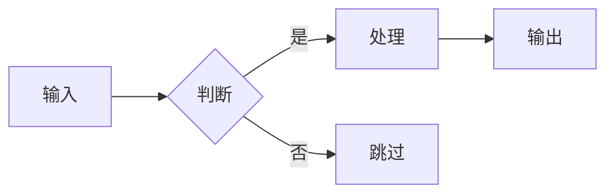
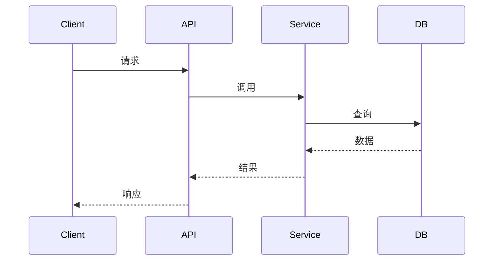
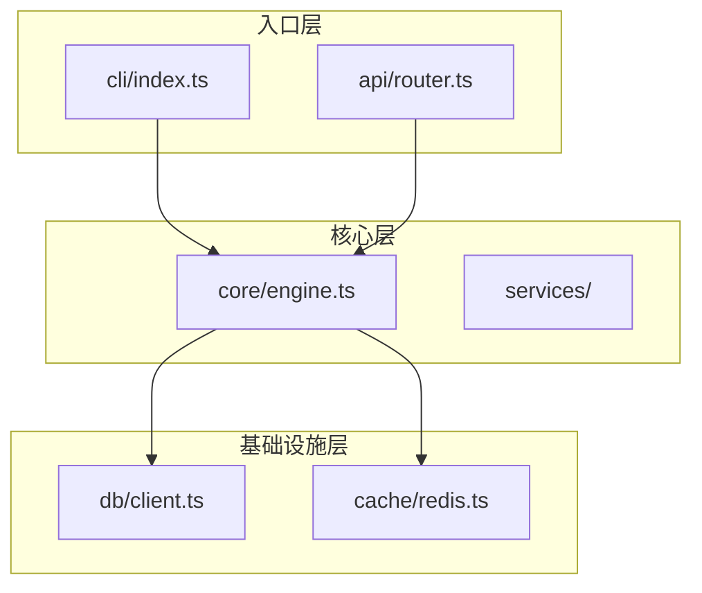
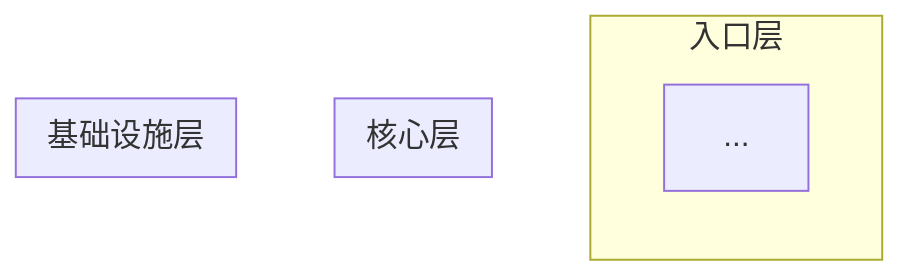

# Project Analyzer v6

深度拆解开源项目：能力清单 + 核心机制 + 设计权衡 + 使用陷阱 + 成熟度评分。

> **核心理念**：不是"这个项目有哪些文件"，而是"这个项目能帮我做什么"+"它是怎么做到的"+"我能信任它吗"。

## 三个触发命令

| 命令 | 输出 | 目的 |
|------|------|------|
| `/project-analyzer` | 分析报告 | 项目是什么、值不值得用 |
| `/project-analyzer modules` | 模块拆解 | 理解实现流程和原理 |
| `/project-analyzer setup` | 启动指南 | 把项目跑起来 |

**路由逻辑：**
- 如果用户输入包含 `modules` 或 `模块拆解` → 输出模块拆解文档
- 如果用户输入包含 `setup` 或 `启动指南` 或 `怎么跑起来` → 输出启动指南
- 否则 → 输出分析报告（默认）

---

# 文档 1：分析报告 (`/project-analyzer`)

## When to Activate

**适用场景：**
- 学习优秀开源项目的设计思想
- 技术选型前的深度调研（"用它还是用竞品"）
- 竞品分析（"它比我的方案好在哪"）
- 接手陌生代码库前的理解
- 为团队产出技术分享材料

**不适用：**
- 快速上手指南 → 用 `/project-analyzer setup`
- 深入理解实现 → 用 `/project-analyzer modules`
- 代码审查 → 用 `code-review`
- 安全审计 → 用 `security-review`

## 输出格式：一句话先行

**每份分析报告必须以一句话总结开头：**

```
项目分析: [成熟度评分]/100, [评级], [一句话核心价值], [最大亮点]和[最大风险]是需要关注的两点。
```

**示例：**
```
项目分析: 82/100, 可信赖, 跨 AI Agent 工具的可复用工作流系统, Hook 系统设计和学习曲线陡峭是需要关注的两点。
```

## 成熟度评分系统

### 评分维度

| 维度 | 权重 | 检查内容 |
|------|------|----------|
| **文档完整性** | 15% | README、API 文档、示例、CHANGELOG |
| **代码质量** | 20% | 测试覆盖、类型安全、错误处理、代码风格 |
| **社区活跃度** | 15% | Stars、最近提交、Issue 响应、贡献者数量 |
| **架构清晰度** | 20% | 模块划分、依赖关系、扩展点设计 |
| **使用体验** | 15% | 安装难度、配置复杂度、报错信息 |
| **维护状态** | 15% | 最近发布、依赖更新、安全修复 |

### 评级标准

| 评级 | 分数 | 含义 |
|------|------|------|
| **不推荐** | 0-49 | 存在严重问题，不建议在生产中使用 |
| **谨慎使用** | 50-69 | 可用但有明显短板，需要额外投入 |
| **可信赖** | 70-84 | 成熟可用，有小问题但不影响核心功能 |
| **优秀** | 85-100 | 设计优秀、文档完善、社区活跃 |

### 强制降分规则

| 条件 | Cap 到 |
|------|--------|
| 无任何测试 | ≤ 59 |
| README 少于 50 行 | ≤ 69 |
| 超过 1 年无提交 | ≤ 69 |
| 无错误处理/全局 try-catch | ≤ 69 |
| 有已知安全漏洞未修复 | ≤ 49 |
| 核心依赖已废弃 | ≤ 59 |

## 分析框架：8 维拆解模型

| # | 维度 | 回答什么问题 | 输出 |
|---|------|-------------|------|
| 0 | **一句话总结** | 总体评价是什么？ | 评分 + 评级 + 核心价值 |
| 1 | **定位** | 解决什么问题？给谁用？ | 一句话定位 + 目标用户 |
| 2 | **能力清单** | 能帮用户做什么？ | 能力表格 + 触发方式 |
| 3 | **核心机制** | 最关键的实现原理是什么？ | 机制图 + 分步解释 |
| 4 | **数据流** | 数据怎么流动？状态怎么变化？ | 流程图 + 关键节点 |
| 5 | **扩展点** | 怎么扩展？怎么定制？ | 扩展点表格 + 示例 |
| 6 | **设计决策** | 为什么这样做？放弃了什么？ | ADR 格式决策记录 |
| 7 | **使用陷阱** | 什么情况下会出问题？ | 陷阱清单 + 规避方法 |

## 工作流程

### Phase 0: 一句话总结 (最先输出)

**在任何详细分析之前，先输出一句话总结：**

```markdown
## 一句话总结

项目分析: [XX]/100, [评级], [核心价值一句话], [亮点]和[风险]是需要关注的两点。
```

### Phase 1: 快速定位 (2-3 分钟)

```bash
# 并行执行
head -100 README.md
cat package.json | jq '.description, .keywords, .repository'
git log --oneline -10 2>/dev/null || echo "No git history"
```

**输出：**
```markdown
## 定位

### 一句话定位
[用户类型] 使用 [项目名] 来 [解决问题/达成目标]。

### 通俗解释（问题-方案-类比）

**问题**
[用 2-3 句话描述没有这个项目时的痛点，要具体、有画面感]

**方案**
[用 2-3 句话描述这个项目怎么解决问题，要简单直白]

**类比**
- **没有它**：[一个生活化的类比，描述痛苦场景]
- **有了它**：[一个生活化的类比，描述解决后的场景]

### 目标用户
| 用户群 | 核心需求 | 该项目如何满足 |
|--------|----------|----------------|
| [用户群 1] | [需求] | [满足方式] |

### 核心价值
1. [价值点 1]（证据: [文件:行号]）
2. [价值点 2]（推断自: [线索]）
```

### Phase 2: 能力清单 (5-10 分钟)

**检测方法：**

```bash
# 找入口点/命令/API
rg "export (function|const|class)" --type ts | head -30
rg "\.command\(|subcommand|argparse" | head -20

# 找配置项
rg "interface.*Config|type.*Options" --type ts | head -10

# 找 README 中的 Features
rg -A 20 "## Features|## 功能|## Capabilities" README.md
```

**输出格式：**

```markdown
## 能力清单

### 核心能力

| 能力 | 描述 | 触发方式 | 证据 |
|------|------|----------|------|
| [能力 1] | [描述] | [命令/API] | `file:line` |
| [能力 2] | [描述] | [命令/API] | 推断自 [线索] |

### 能力边界

| 不支持 | 原因 | 替代方案 |
|--------|------|----------|
| [功能 X] | [原因] | [替代] |
```

### Phase 3: 核心机制 (10-15 分钟)

**输出格式（含 Mermaid 图）：**

```markdown
## 核心机制

### 机制 1: [名称]

#### 问题
[这个机制要解决什么问题？]

#### 原理（一段话）
[2-3 句话核心思路]

#### 工作流程


#### 分步详解

| 步骤 | 做什么 | 为什么 | 代码位置 |
|------|--------|--------|----------|
| 1 | [动作] | [原因] | `file:line` |

#### 关键代码
```[language]
// 核心代码片段（带注释）
```

#### 边界情况
| 情况 | 处理方式 |
|------|----------|
| [边界 1] | [处理] |
```

### Phase 4: 数据流 (5-10 分钟)

```markdown
## 数据流

### 流程: [功能名称]



### 关键节点

| 节点 | 位置 | 输入 | 输出 | 副作用 |
|------|------|------|------|--------|
| [节点] | `file:line` | [输入] | [输出] | [副作用] |
```

### Phase 5: 扩展点 (5 分钟)

```markdown
## 扩展点

| 扩展点 | 用途 | 接口/协议 | 示例位置 |
|--------|------|----------|----------|
| [扩展点 1] | [用途] | [接口] | `file:line` |

### 扩展示例
```[language]
// 最简单的扩展示例
```
```

### Phase 6: 设计决策 (ADR 格式) (5-10 分钟)

```markdown
## 设计决策

### 决策 1: [决策标题]

**状态**: accepted | proposed | deprecated

#### Context
[什么问题促使了这个决策？]

#### Decision
[选择了什么？]

#### Alternatives Considered

| 替代方案 | 优点 | 缺点 | 不选原因 |
|----------|------|------|----------|
| [方案 A] | [优点] | [缺点] | [原因] |

#### Consequences

**获得:** [好处]
**放弃:** [代价]
**风险:** [潜在风险]
**重评估条件:** [什么情况下应该重新考虑]
```

### Phase 7: 使用陷阱 (5 分钟)

```markdown
## 使用陷阱

### 陷阱 1: [名称]

| 触发条件 | 症状 | 原因 | 规避方法 |
|----------|------|------|----------|
| [条件] | [症状] | [原因] | [规避] |

### 快速诊断表

| # | 症状 | 可能原因 | 检查方法 |
|---|------|----------|----------|
| 1 | [症状] | [原因] | [命令] |
```

### Phase 8: 学习路径 (3 分钟)

```markdown
## 学习路径

### 快速上手（30 分钟）
1. [第一步] — 目标: [达成什么]
2. [第二步] — 目标: [达成什么]

### 深入理解（2-4 小时）
| 想理解... | 看这个文件 | 预计时间 |
|-----------|------------|----------|
| [概念 1] | `path/file.ts` | 30 分钟 |

### Next Action
[一个具体的下一步行动建议]
```

## 架构图生成规则

### 模块检测启发式

```
# 层级分配规则 (按文件夹名称)
Entry 层: cli/, cmd/, bin/, api/, routes/, pages/, app/
Core 层: core/, domain/, services/, lib/, modules/
Infra 层: db/, database/, cache/, queue/, storage/, infra/
Utils 层: utils/, helpers/, common/, shared/

# 如果文件夹不匹配，按深度分配
深度 1 (src/xxx.ts): Entry 层
深度 2 (src/xxx/yyy.ts): Core 层
深度 3+ (src/xxx/yyy/zzz.ts): Infra 或 Utils 层
```

### 图规模控制

- 模块 ≤ 30: 完整图
- 模块 31-50: 只显示核心模块 + 直接依赖
- 模块 > 50: 只显示层级概览图（不显示具体文件）

### 架构图模板



## Hot Spot Detection (内部算法)

在分析时用于识别关键文件，优先深入分析。

### 评分公式

```
inbound_norm = (file_refs / max_refs_in_project) × 100
churn_norm = (file_edits / max_edits_in_project) × 100
name_norm = 100 if filename contains [core|engine|service|handler|manager|controller|router] else 0
size_norm = 100 if 200 <= lines <= 800 else max(0, 100 - abs(lines - 500) / 5)

Score = (inbound_norm × 0.4) + (churn_norm × 0.3) + (name_norm × 0.2) + (size_norm × 0.1)
```

### 检测命令

```bash
# 1. 入口点检测
rg -l "^(export )?(async )?function main|^const app =|^export default" --type ts
find . -name "main.*" -o -name "index.*" -o -name "cli.*" -o -name "server.*" -o -name "app.*"

# 2. 引用计数 (PageRank-lite)
rg "from ['\"]\./" --type ts | cut -d: -f2 | sort | uniq -c | sort -rn | head -20

# 3. Git 热度
git log --since="6 months ago" --name-only --pretty=format: | sort | uniq -c | sort -rn | head -20

# 4. 文件大小甜区 (200-800 行)
find . -name "*.ts" -exec wc -l {} \; | awk '$1 >= 200 && $1 <= 800 {print}' | sort -rn

# 5. 名称相关性
find . -name "*core*" -o -name "*engine*" -o -name "*service*" -o -name "*handler*" -o -name "*manager*"
```

## 完整输出模板

```markdown
# [项目名] 深度分析报告

> 分析框架: project-analyzer v6
> 分析时间: [日期]
> 分析深度: [快速/标准/深入]

---

## 一句话总结

项目分析: [XX]/100, [评级], [核心价值], [亮点]和[风险]是需要关注的两点。

---

## 架构概览



## 一、定位
[一句话定位 + 通俗解释（问题-方案-类比） + 目标用户 + 核心价值]

## 二、能力清单
[能力表格 + 能力边界]

## 三、核心机制
[机制图 + 分步解释]

## 四、数据流
[流程图 + 关键节点]

## 五、扩展点
[扩展点表格 + 示例]

## 六、设计决策
[ADR 格式]

## 七、使用陷阱
[陷阱表格 + 快速诊断表]

## 八、学习路径
[内容，含 Next Action]

---

## 附录

### 评分明细

| 维度 | 得分 | 满分 | 备注 |
|------|------|------|------|
| 文档完整性 | [X] | 15 | [备注] |
| 代码质量 | [X] | 20 | [备注] |
| 社区活跃度 | [X] | 15 | [备注] |
| 架构清晰度 | [X] | 20 | [备注] |
| 使用体验 | [X] | 15 | [备注] |
| 维护状态 | [X] | 15 | [备注] |
| **总分** | **[XX]** | **100** | [强制 cap 说明] |
```

## 分析深度控制

| 深度 | 耗时 | 输出内容 |
|------|------|----------|
| **快速** | 10-15 分钟 | 一句话总结 + 架构图 + 定位 + 能力清单 + 1 个机制 |
| **标准** | 30-45 分钟 | 上述 + 数据流 + 扩展点 + 陷阱 |
| **深入** | 60-90 分钟 | 完整 8 维分析 + 所有核心机制 + ADR 格式决策 |

## Anti-Patterns

- ❌ **评分无依据** — 每个评分维度必须有备注
- ❌ **只说好不说坏** — 必须包含使用陷阱和风险
- ❌ **复制 README** — 分析报告必须增加结构化洞察
- ❌ **无 Next Action** — 必须给出一个具体的下一步
- ❌ **模糊描述** — 避免"处理数据"、"执行逻辑"等空话
- ❌ **无架构图** — 必须包含 Mermaid 架构概览图

## 质量检查清单

### 必须包含
- [ ] 一句话总结（评分 + 评级 + 核心价值）
- [ ] 架构概览 Mermaid 图
- [ ] 能力清单（至少 5 个能力）
- [ ] 至少 1 个核心机制深入解释（含 Mermaid 流程图）
- [ ] 至少 3 个使用陷阱
- [ ] Next Action

### 禁止
- [ ] 无证据支撑的评分
- [ ] 只有优点没有缺点
- [ ] 模糊描述（"处理数据"、"执行逻辑"）

---

# 文档 2：模块拆解 (`/project-analyzer modules`)

**路由触发词：** `modules`, `模块拆解`, `拆解模块`

**目的：** 理解实现流程和原理

详见 [MODULES.md](./MODULES.md)

---

# 文档 3：启动指南 (`/project-analyzer setup`)

**路由触发词：** `setup`, `启动指南`, `怎么跑起来`

**目的：** 把项目跑起来

详见 [SETUP.md](./SETUP.md)

---

## 与其他 Skill 配合

| 场景 | 组合使用 |
|------|----------|
| 快速上手 | `/project-analyzer setup` → 跑起来 |
| 理解实现 | `/project-analyzer` → `/project-analyzer modules` |
| 技术选型 | `/project-analyzer` × N 个项目 → 对比分析 |
| 生产评估 | `/project-analyzer` → `production-audit` |
| 贡献代码 | `/project-analyzer modules` → 理解后开始改 |
