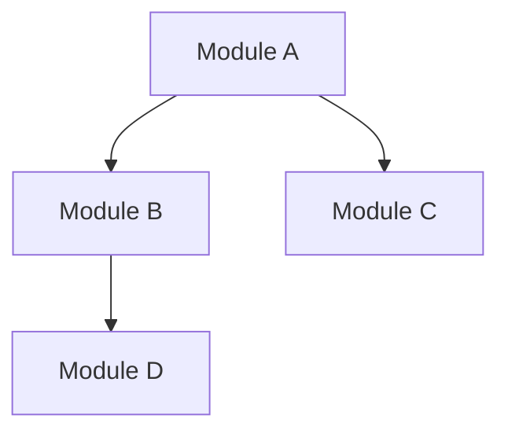

# 分析框架详解

## 五层分析模型

### Layer 1: 定位层 (What & Why)

**目标**：用一句话说清楚这个项目是什么

**关键问题**：
- 解决什么问题？
- 目标用户是谁？
- 核心价值是什么？
- 和同类项目有什么区别？

**信息来源**：
- README.md 的开头描述
- package.json 的 description
- 官方文档的 introduction
- GitHub 的 About 描述

**输出格式**：
```markdown
## 项目定位

**一句话定位**: [用户] 使用 [项目名] 来 [解决问题/达成目标]

**核心价值**:
1. [价值点1]
2. [价值点2]
3. [价值点3]

**目标用户**:
- [用户群体1]: [他们的需求]
- [用户群体2]: [他们的需求]

**与同类项目对比**:
| 特性 | 本项目 | 竞品A | 竞品B |
|------|--------|-------|-------|
```

---

### Layer 2: 架构层 (Structure)

**目标**：理解系统的整体结构和模块划分

**关键问题**：
- 系统由哪些模块组成？
- 模块之间如何通信？
- 边界在哪里？
- 扩展点在哪里？

**分析方法**：

1. **目录结构分析**
   ```bash
   # 获取目录结构（排除常见忽略目录）
   find . -type d -maxdepth 3 \
     -not -path "*/node_modules/*" \
     -not -path "*/.git/*" \
     -not -path "*/dist/*" \
     -not -path "*/build/*"
   ```

2. **依赖分析**
   - 分析 import/require 语句
   - 绘制模块依赖图
   - 识别循环依赖

3. **分层识别**
   ```
   表现层 → 业务层 → 数据层 → 基础设施层

   表现层: UI组件、API handlers、CLI commands
   业务层: Services、Use cases、Domain logic
   数据层: Repositories、DAOs、Models
   基础设施层: Utils、Helpers、Adapters、Clients
   ```

4. **边界识别**
   - 公共 API（导出的函数/类）
   - 插件接口（hooks、middleware、plugins）
   - 配置入口（config files、env vars）

**输出格式**：
```markdown
## 架构全景

### 系统架构图
```
┌─────────────────────────────────────────┐
│              表现层                      │
│  ┌─────────┐  ┌─────────┐  ┌─────────┐ │
│  │  CLI    │  │   API   │  │   UI    │ │
│  └────┬────┘  └────┬────┘  └────┬────┘ │
├───────┼────────────┼────────────┼───────┤
│       └────────────┼────────────┘       │
│              业务层│                     │
│         ┌─────────┴─────────┐          │
│         │     Services      │          │
│         └─────────┬─────────┘          │
├───────────────────┼─────────────────────┤
│              数据层│                     │
│         ┌─────────┴─────────┐          │
│         │   Repositories    │          │
│         └─────────┬─────────┘          │
├───────────────────┼─────────────────────┤
│              基础设施层                  │
│  ┌─────────┐  ┌─────────┐  ┌─────────┐ │
│  │ Database│  │  Cache  │  │  HTTP   │ │
│  └─────────┘  └─────────┘  └─────────┘ │
└─────────────────────────────────────────┘
```

### 模块职责

| 模块 | 路径 | 职责 | 依赖 |
|------|------|------|------|
| [模块名] | `src/xxx/` | [职责描述] | [依赖模块] |

### 依赖关系图


### 扩展点

| 扩展点 | 位置 | 用途 |
|--------|------|------|
| [扩展点名] | `src/xxx.ts` | [如何扩展] |
```

---

### Layer 3: 流程层 (Flow)

**目标**：追踪核心功能的完整执行路径

**关键问题**：
- 请求从哪里进入？
- 经过哪些处理步骤？
- 数据如何转换？
- 状态如何变化？
- 错误如何处理？

**追踪方法**：

1. **选择追踪目标**
   - 最核心的功能（项目的主要价值点）
   - README 重点介绍的功能
   - 用户特别关心的功能

2. **入口定位**
   ```
   HTTP API → router → handler
   CLI → command → handler
   UI → event → handler
   ```

3. **逐步追踪**
   ```
   每一步记录：
   - 文件:行号
   - 函数名
   - 输入参数
   - 处理逻辑
   - 输出结果
   - 副作用
   ```

4. **状态追踪**
   - 全局状态变化
   - 数据库操作
   - 缓存更新
   - 事件发送

**输出格式**：
```markdown
## 核心流程: [功能名称]

### 流程概览
```
用户请求 → 入口验证 → 业务处理 → 数据持久化 → 响应返回
```

### 详细步骤

#### Step 1: 入口
- **文件**: `src/api/handler.ts:42`
- **函数**: `handleRequest()`
- **输入**: `{ userId, action, payload }`
- **处理**: 解析请求，提取参数
- **输出**: 结构化的请求对象

#### Step 2: 验证
- **文件**: `src/middleware/auth.ts:15`
- **函数**: `validateAuth()`
- **输入**: 请求对象 + token
- **处理**: 验证 token，检查权限
- **输出**: 用户上下文
- **错误处理**: 无效 token → 401

#### Step 3: 业务逻辑
...

### 数据流图
```
Request → [Validate] → [Process] → [Store] → Response
            ↓             ↓           ↓
          Error         Events      Cache
```

### 关键文件
| 步骤 | 文件 | 行号 |
|------|------|------|
| 入口 | `src/api/handler.ts` | 42 |
| 验证 | `src/middleware/auth.ts` | 15 |
```

---

### Layer 4: 原理层 (How)

**目标**：深入理解关键实现的工作原理

**关键问题**：
- 核心算法是什么？
- 为什么这样实现？
- 时间/空间复杂度？
- 边界情况如何处理？

**分析方法**：

1. **识别关键实现**
   - 核心算法（排序、搜索、匹配、调度）
   - 核心数据结构（树、图、缓存、队列）
   - 核心模式（状态机、管道、观察者、策略）

2. **逐层解析**
   ```
   Level 1: 功能概述（做什么）
   Level 2: 算法思路（怎么做）
   Level 3: 实现细节（具体代码）
   Level 4: 边界处理（特殊情况）
   ```

3. **复杂度分析**
   - 时间复杂度
   - 空间复杂度
   - 最好/最坏/平均情况

**输出格式**：
```markdown
## 实现原理: [功能名称]

### 问题定义
**输入**: [输入描述]
**输出**: [输出描述]
**约束**: [约束条件]

### 算法概述
[用 2-3 句话描述核心思路]

### 分步详解

#### Step 1: [步骤名]
**目的**: [为什么需要这一步]
**做法**: [具体怎么做]
**代码**:
```python
# 关键代码片段（带注释）
def step1(input):
    # 处理逻辑
    return output
```

#### Step 2: [步骤名]
...

### 数据结构
```
[数据结构示意图]
```

### 状态转换
```
State A --[event]--> State B --[event]--> State C
```

### 边界情况
| 情况 | 处理方式 | 代码位置 |
|------|----------|----------|
| 空输入 | 返回默认值 | `line:42` |
| 超大输入 | 分批处理 | `line:58` |

### 复杂度
- **时间**: O(n log n) — [原因]
- **空间**: O(n) — [原因]
```

---

### Layer 5: 决策层 (Why This Way)

**目标**：理解设计决策背后的思考

**关键问题**：
- 为什么选择这个技术？
- 为什么这样划分模块？
- 有什么权衡取舍？
- 有什么替代方案？

**分析方法**：

1. **技术选型分析**
   - 列出主要技术依赖
   - 分析选择原因
   - 对比替代方案

2. **架构决策分析**
   - 模块划分的原因
   - 通信方式的选择
   - 错误处理策略

3. **设计模式识别**
   - 识别使用的模式
   - 分析使用原因
   - 评估是否过度设计

**输出格式**：
```markdown
## 设计决策: [决策名称]

### 背景
[为什么需要做这个决策]

### 决策
[最终选择了什么]

### 原因
1. [原因1]
2. [原因2]
3. [原因3]

### 权衡
| 维度 | 获得 | 放弃 |
|------|------|------|
| 性能 | [+] | [-] |
| 复杂度 | [+] | [-] |
| 可维护性 | [+] | [-] |

### 替代方案
| 方案 | 优点 | 缺点 | 不选原因 |
|------|------|------|----------|
| 方案A | ... | ... | ... |
| 方案B | ... | ... | ... |

### 重新评估条件
[什么情况下应该重新考虑这个决策]
```

---

## 分析质量检查清单

### 定位层
- [ ] 一句话能说清楚项目做什么
- [ ] 目标用户明确
- [ ] 核心价值清晰
- [ ] 与同类项目对比

### 架构层
- [ ] 有架构图
- [ ] 模块职责清晰
- [ ] 依赖关系明确
- [ ] 扩展点标注

### 流程层
- [ ] 追踪了核心功能
- [ ] 每步有文件:行号
- [ ] 数据流清晰
- [ ] 错误处理说明

### 原理层
- [ ] 解释了"为什么"
- [ ] 有代码片段
- [ ] 有复杂度分析
- [ ] 边界情况覆盖

### 决策层
- [ ] 技术选型有理由
- [ ] 权衡取舍明确
- [ ] 替代方案列出
- [ ] 重评估条件说明
