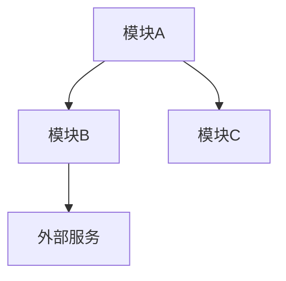

# 输出模板参考

## 完整报告模板

```markdown
# [项目名] 深度分析报告

> 分析时间: [日期]
> 分析深度: [快速/标准/深入]
> 项目版本: [版本号或 commit hash]

---

## 一、项目定位

### 一句话定位
[用户] 使用 [项目名] 来 [解决问题/达成目标]。

### 解决什么问题
[2-3 句话描述核心问题]

### 目标用户
- **[用户群1]**: [他们的需求和痛点]
- **[用户群2]**: [他们的需求和痛点]

### 核心价值
1. **[价值点1]** — [简要说明]
2. **[价值点2]** — [简要说明]
3. **[价值点3]** — [简要说明]

---

## 二、技术栈概览

| 层级 | 技术 | 版本 | 用途 |
|------|------|------|------|
| 语言 | [Language] | [x.x] | 主要开发语言 |
| 框架 | [Framework] | [x.x] | [用途] |
| 数据库 | [DB] | [x.x] | [用途] |
| 缓存 | [Cache] | [x.x] | [用途] |
| 构建工具 | [Tool] | [x.x] | [用途] |
| 测试框架 | [Test] | [x.x] | [用途] |

### 关键依赖
| 依赖 | 用途 | 为什么选它 |
|------|------|------------|
| [dep1] | [用途] | [原因] |
| [dep2] | [用途] | [原因] |

---

## 三、架构全景

### 系统架构图

```
[ASCII 或 Mermaid 架构图]
```

### 模块职责

| 模块 | 路径 | 职责 | 对外接口 |
|------|------|------|----------|
| [模块1] | `src/xxx/` | [职责] | [接口] |
| [模块2] | `src/yyy/` | [职责] | [接口] |

### 目录结构

```
project-root/
├── src/
│   ├── [dir1]/          # [职责说明]
│   ├── [dir2]/          # [职责说明]
│   └── [dir3]/          # [职责说明]
├── tests/               # 测试文件
├── docs/                # 文档
└── [config files]       # 配置文件
```

### 依赖关系



### 扩展点

| 扩展点 | 位置 | 扩展方式 |
|--------|------|----------|
| [扩展点1] | `src/xxx.ts` | [如何扩展] |
| [扩展点2] | `src/yyy.ts` | [如何扩展] |

---

## 四、核心流程

### 流程 1: [功能名称]

#### 概览
```
[入口] → [验证] → [处理] → [存储] → [响应]
```

#### 详细步骤

| # | 步骤 | 文件 | 行号 | 说明 |
|---|------|------|------|------|
| 1 | 入口 | `src/api/handler.ts` | 42 | 接收请求 |
| 2 | 验证 | `src/middleware/auth.ts` | 15 | 校验权限 |
| 3 | 处理 | `src/services/xxx.ts` | 28 | 业务逻辑 |
| 4 | 存储 | `src/repos/xxx.ts` | 55 | 持久化 |
| 5 | 响应 | `src/api/handler.ts` | 67 | 返回结果 |

#### 数据流

```
Request { userId, action }
    ↓
Validated { user, permissions }
    ↓
Processed { result, events }
    ↓
Stored { id, timestamp }
    ↓
Response { success, data }
```

#### 错误处理

| 错误类型 | 处理方式 | 位置 |
|----------|----------|------|
| 认证失败 | 返回 401 | `auth.ts:25` |
| 参数错误 | 返回 400 | `validator.ts:18` |
| 内部错误 | 返回 500 + 日志 | `handler.ts:80` |

---

### 流程 2: [功能名称]

[同上结构]

---

## 五、实现原理

### 原理 1: [核心功能/算法名称]

#### 问题定义

**输入**: [输入描述和格式]
**输出**: [输出描述和格式]
**约束**: [性能、正确性等约束]

#### 算法思路

[用 2-3 段话解释核心思路，为什么这样做]

#### 分步详解

**Step 1: [步骤名]**
- 目的: [为什么需要这一步]
- 做法: [具体怎么做]

```[language]
// 关键代码，带注释
function step1(input) {
  // 处理逻辑解释
  return output;
}
```

**Step 2: [步骤名]**
[同上]

#### 数据结构

```
[数据结构示意图]

例如：
Node {
  value: any
  left: Node | null
  right: Node | null
}
```

#### 状态转换（如适用）

```
[初始] --[事件1]--> [状态A] --[事件2]--> [状态B]
                       |
                       +--[事件3]--> [状态C]
```

#### 边界情况

| 情况 | 输入 | 处理 | 输出 |
|------|------|------|------|
| 空输入 | `null` | 返回默认 | `{}` |
| 超大 | `n > 10000` | 分批 | 批次结果 |

#### 复杂度

- **时间**: O([复杂度]) — [解释]
- **空间**: O([复杂度]) — [解释]

---

### 原理 2: [核心功能/算法名称]

[同上结构]

---

## 六、设计决策

### 决策 1: [技术选型/架构决策]

#### 背景
[什么情况下需要做这个决策]

#### 决策内容
[最终选择了什么]

#### 选择原因
1. [原因1]
2. [原因2]
3. [原因3]

#### 权衡取舍

| 维度 | 获得 | 放弃 |
|------|------|------|
| 性能 | [描述] | [描述] |
| 复杂度 | [描述] | [描述] |
| 可维护性 | [描述] | [描述] |
| 学习成本 | [描述] | [描述] |

#### 替代方案

| 方案 | 优点 | 缺点 | 不选原因 |
|------|------|------|----------|
| [方案A] | [优点] | [缺点] | [原因] |
| [方案B] | [优点] | [缺点] | [原因] |

#### 重新评估条件
[什么情况下应该重新考虑这个决策]

---

### 决策 2: [技术选型/架构决策]

[同上结构]

---

## 七、亮点与不足

### 设计亮点

1. **[亮点1]**
   - 体现在: [具体位置]
   - 价值: [带来什么好处]
   - 可学习: [可以借鉴的地方]

2. **[亮点2]**
   [同上]

### 可改进之处

1. **[问题1]**
   - 位置: [具体位置]
   - 问题: [问题描述]
   - 建议: [改进建议]

2. **[问题2]**
   [同上]

---

## 八、学习要点

### 可复用的模式

| 模式 | 使用场景 | 本项目中的实现 |
|------|----------|----------------|
| [模式1] | [场景] | [位置和说明] |
| [模式2] | [场景] | [位置和说明] |

### 值得学习的技巧

1. **[技巧1]**: [说明和位置]
2. **[技巧2]**: [说明和位置]

### 避免的反模式

1. **[反模式1]**: [为什么要避免]
2. **[反模式2]**: [为什么要避免]

---

## 附录

### 关键文件索引

| 文件 | 用途 | 重要程度 |
|------|------|----------|
| `src/xxx.ts` | [用途] | 高 |
| `src/yyy.ts` | [用途] | 中 |

### 术语表

| 术语 | 含义 |
|------|------|
| [术语1] | [含义] |
| [术语2] | [含义] |

### 参考资料

- [官方文档](链接)
- [相关博客](链接)
- [设计文档](链接)
```

---

## 快速报告模板（5-10分钟）

```markdown
# [项目名] 快速分析

## 一句话定位
[用户] 使用 [项目名] 来 [解决问题]。

## 技术栈
- 语言: [Language]
- 框架: [Framework]
- 数据库: [DB]

## 架构概览
```
[简单架构图]
```

## 核心目录
| 目录 | 职责 |
|------|------|
| `src/xxx/` | [职责] |

## 入口点
- 主入口: `src/index.ts`
- API: `src/api/`
- 配置: `config/`

## 快速上手
```bash
# 安装
npm install

# 运行
npm run dev
```
```

---

## 流程分析模板

```markdown
# [功能名] 流程分析

## 触发条件
[什么情况下触发这个流程]

## 流程图
```
[流程图]
```

## 步骤详解

### Step 1: [步骤名]
- **位置**: `file:line`
- **输入**: [描述]
- **处理**: [描述]
- **输出**: [描述]

### Step 2: [步骤名]
...

## 关键代码
```[language]
// 代码片段
```

## 注意事项
- [注意点1]
- [注意点2]
```

---

## 原理解释模板

```markdown
# [功能/算法] 原理解析

## 要解决的问题
[问题描述]

## 核心思路
[用简单的话解释思路]

## 分步骤理解

### Step 1: [做什么]
[为什么这样做]

```[language]
// 代码
```

### Step 2: [做什么]
...

## 示意图
```
[图示]
```

## 举例说明
输入: [具体输入]
过程: [处理过程]
输出: [具体输出]

## 边界情况
| 情况 | 处理 |
|------|------|
```
